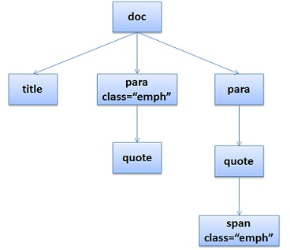

# 浏览器原理


深入理解现代浏览器

https://mp.weixin.qq.com/s?__biz=Mzg5NDEyMzA2NQ==&mid=2247484400&idx=1&sn=9c7d4b7f346034fd06e2a587cb9c58cf&chksm=c0252ea6f752a7b06e0e6ba4346581fbe864ec769963ffa6cf4b0c7204f4afb0ddb44a76e6cd&mpshare=1&scene=1&srcid=1008vvgoRuGQgyy1MwuzlS8T&sharer_sharetime=1570506760100&sharer_shareid=778ad5bf3b27e0078eb105d7277263f6#rd


万字详文：深入理解浏览器原理

https://zhuanlan.zhihu.com/p/96986818?tdsourcetag=s_pctim_aiomsg


现代浏览器内部工作原理（附详细流程图）

https://mp.weixin.qq.com/s?__biz=MzA4ODUzNTE2Nw==&mid=2451046766&idx=1&sn=4d9177602ebd278bfa5c5bc959598b73&chksm=87c4187eb0b3916869bc64d39e7b3c6e59bb2c5fe2789d9a888be2cb6cda4c7cc4ff05d99e8b&mpshare=1&scene=1&srcid=&sharer_sharetime=1583904346478&sharer_shareid=778ad5bf3b27e0078eb105d7277263f6#rd


前端都该懂的浏览器工作原理

https://segmentfault.com/a/1190000022633988

面试中经常问到的一个点：从在浏览器地址栏输入URL到页面显示，浏览器到底发生了什么？


## 浏览器架构

进程和线程


左耳朵耗子写的浏览器原理（以他为准）

https://coolshell.cn/articles/9666.html


先说结论：


## 浏览器工作大致流程

先上一张图：


从图中我们可以知道：

1. 浏览器会解析三个东西：
   1. 一个是HTML/SVG/XHTML，事实上，webkit 有三个 C++ 的类对应这三类文档。解析这三种文件产生一个DOM Tree。
   2. CSS，解析CSS会产生CSS规则
   3. Javascript，脚本，主要是通过DOM API 和 CSSOM API 来操作 DOM Tree 和 CSS Rule Tree
2. 解析完成后，浏览器引擎会通过 DOM Tree 和 CSS Rule Tree 来构造 Rendering Tree，注意：
   1. Rendering Tree 渲染树并不等同于 DOM 树，因为一些像 Header 或 display:none 的东西就没必要放在渲染树上
   2. CSS 的 Rule Tree 主要是为了完成匹配并把 CSS Rule 附加上 Rendering Tree 上的每个 Element。也就是DOM节点。也就是所谓的 Frame。
   3. 然后，计算每个 Frame（也就是每个Element）的位置，这又叫layout和reflow（回流）过程
3. 最后通过调用操作系统 Native GUI 的 API 绘制

## DOM解析

HTML 的 DOM Tree 解析如下：

```html
<html>
<html>
<head>
    <title>Web page parsing</title>
</head>
<body>
    <div>
        <h1>Web page parsing</h1>
        <p>This is an example Web page.</p>
    </div>
</body>
</html>
```

上面这段HTML会解析成这样：


下面是另一个有SVG标签的情况：


## CSS解析

CSS的解析大概是下面这个样子（下面是Firefox的玩法），假设我们有下面的HTML文档：

```html
<doc>
    <title>A few quotes</title>
    <para class="emph">
      Franklin said that <quote>"A penny saved is a penny earned."</quote>
    </para>
    <para>
      FDR said
        <quote>"We have nothing to fear but 
        	<span class="emph">fear itself.</span>"
        </quote>
    </para>
</doc>
```

于是 DOM Tree 是这个样子：



然后我们的CSS文档是这样的：

```css
/* rule 1 */ doc { display: block; text-indent: 1em; }
/* rule 2 */ title { display: block; font-size: 3em; }
/* rule 3 */ para { display: block; }
/* rule 4 */ [class="emph"] { font-style: italic; }
```

于是我们的CSS Rule Tree 会是这个样子：


途中的第四条规则出现了两次，一次是独立的，一次是在规则3的子节点。所以，我们可以知道，建立CSS Rule Tree 是需要比照着 DOM Tree 来着。CSS 匹配 DOM Tree 主要是从右到左解析 CSS 的 Selector，好多人以为这个事会比较快，其实并不一定。关键还看我们的 CSS 的 Selector 怎么写了。

**注意：CSS 匹配 HTML 元素是一个相对复杂和有性能问题的事情。所以，你就会在N多地方看到很多人都告诉你，DOM树要小，CSS尽量用id和class，千万不要过度层叠下去......**

所以，Firefox 基本上来说是通过CSS 解析生成 CSS Rule Tree，然后，通过对比 DOM 生成 Style Context Tree，然后 Firefox 通过把 Style Content Tree 和其 Render Tree（Frame Tree）关联上，就完成了。主要：Render Tree 会把一些不可见的节点去除掉。而 **Firefox 中所谓的 Frame就是一个DOM节点，不要被其名字所迷惑了**


注：Webkit不像Firefox要用两个树来干这个，Webkit也有Style对象，它直接把这个Style对象存在了相应的DOM结点上了。

## 渲染


## 减少reflow（回流）/repaint（重绘）