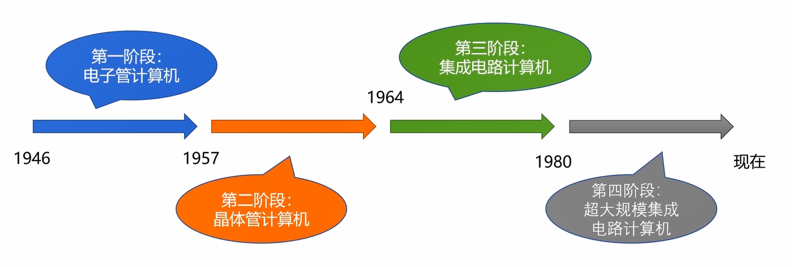

# 计算机的起源

本章分六部分，计算机的发展历程，计算机的分类，计算机的体系结构，计算机的层次与编程语言，计算机的计算单位，计算机的字符与编码集

## 计算机的发展简史

### 计算机发展的四个阶段

​ 1946——1957 电子管计算机

​ 1957——1964 晶体管计算机

​ 1964——1980 集成电路计算机

​ 1980——至今 超大集成电路计算机

​ 

#### 第一阶段：电子管计算机

-   第二次世界大战是电子管计算机产生的催化剂
-   埃尼阿克（ENIAC）
    -   产生原因：
        -   战争使用了飞机和火箭
        -   打得准则需要计算射击参数
        -   射击参数需要几千次运算才能计算出来
    -   特点：
        -   18000 多个电子管
        -   运行耗电量 150 千瓦
        -   重量达 30 吨，占地 1500 平方英尺
-   电子管计算机的特点：
    -   集成度小，空间占用大
    -   功耗搞，运行速度慢
    -   操作复杂，更换程序需要接线

#### 第二阶段：晶体管计算机

起因：贝尔实验室的三个科学家发明了晶体管

特点：

-   集成度相对较高，空间占用相对小
-   功耗相对较低，运行速度较快
-   操作相对简单，交互更加方便

#### 第三阶段：集成电路计算机

起因：德州仪器的工程师发明了集成电路（IC）

特点：

-   计算机变得更小
-   功耗变得更低
-   计算速度变得更快

#### 第四阶段：超大规模集成电路计算机

-   一个芯片集成了上百万的晶体管
-   速度更快，体积更小，价格更低
-   用途更广：应用上升

#### 第五阶段：未来的计算机

生物计算机：以蛋白质分子作为主要原材料

量子计算机：遵循量子力学的物理计算机

### 微型计算机的发展历程

受限于性能

摩尔定律：集成电路的性能，每 18—24 个月就会提升一倍

单核 CPU —— 多核 CPU

## 计算机的分类

## 计算机的体系结构

## 计算机的层次与编程语言

## 计算机的计算单位

### 计算机的字符与编码集

#### 电子管计算机

​ 二极管

​ 第二次世界大战是电子管计算机产生的催化剂

​ 英国为了解密德国海军的密文

​ ps:我觉得可以看看卷福演的《模仿游戏》，讲的就是这件事情，图灵的伟大

​ 电子管计算机——埃尼阿克（ENIAC）,18000 多个电子管，运行耗电量 150 千瓦，重达 30 村，占地 1500 平方英尺
