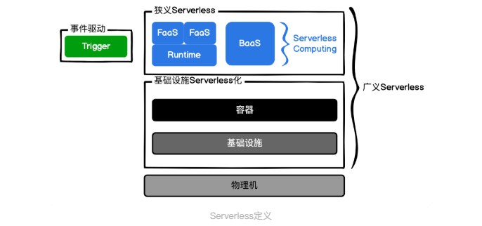

#  Serverless

Serverless 掀起新的前端技术变革

https://mp.weixin.qq.com/s/0v4GbqbW9hKSlSeTiv8mrg

## 1.什么是 Serverless 

Server 这里指服务端，它是 Serverless 解决问题的边界；而 less 我们可以理解为较少关心，它是  Serverless  解决问题的目的。组合在一起就是“较少关心服务端”

###  什么是服务端？ 

 现代研发体系主要分为前端和后端，前端负责客户终端的体验，也就是 View 层；后端负责商业的业务逻辑和数据处理，也就是 Control 层和 Model 层。如果你有过一些开发经验，应该会了解自己的代码在本地开发和调试时的数据流。 

###  服务端运维发展史，从 full 到 less 

 Serverfull 就是服务端运维全由我们自己负责，Serverless 则是服务端运维较少由我们自己负责，大多数的运维工作交给自动化工具负责 

 这个时代研发和运维隔离，服务端运维都交给小服一个人，纯人力处理，也就是 Serverfull。 

史前时代，serverfull（版本发布需要人力）——农耕时代，DevOps（稍微自动化）——工业时代（自动化流程化）——未来（实现 免运维 NoOps ）

到底什么是 Serverless？

 第一种：狭义 Serverless（最常见）= Serverless computing 架构 = FaaS 架构 = Trigger（事件驱动）+ FaaS（函数即服务）+ BaaS（后端即服务，持久化或第三方服务）= FaaS + Baa 

 第二种：广义 Serverless = 服务端免运维 = 具备 Serverless 特性的云服务 

 广义 Serverless，其实就是指服务端免运维，也是未来的主要趋势。 

FaaS(Function as a Service) 就是函数即服务，

BaaS(Backend as a Service) 就是后端即服务。

XaaS(X as a Service) 就是 X 即服务 

SaaS 软件即服务

1. Serverless 能解决什么问题？Serverless 可以使应用在服务端免运维。
2. Serverless 为什么难定义？Serverless 将服务端运维高度抽象成了一种解决方案，包含的信息量太大了。 

 FaaS 就有点像我们的声控灯，有人的时候它可以很快亮起来，没人的时候又可以关着。对比传统的需要人手动开关的灯，声控灯最大的优势肯定就是省电了。但你想想，能省电的前提是有人的时候，声控灯能够找到比较好的方式快速亮起来。 

 FaaS 中的冷启动是指从调用函数开始到函数实例准备完成的整个过程。 

1. 纯 FaaS 应用调用链路由函数触发器、函数服务和函数代码三部分组成，它们分别替代了传统服务端运维的负载均衡 & 反向代理，服务器 & 应用运行环境，应用代码部署。

2. 对比传统应用托管 PaaS 平台，FaaS 应用最大的不同就是，FaaS 应用可以缩容到 0，在事件到来时极速启动，Node.js 的函数甚至可以做到 100ms 启动并执行。
3. FaaS 在设计上牺牲了用户的可控性和应用场景，来简化代码模型，并且通过分层结构进一步提升资源的利用率，这也是为什么 FaaS 冷启动时间能这么短的主要原因。关于 FaaS 的 3 层结构，你可以这么想象：容器层就像是 Windows 操作系统；Runtime 就像是 Windows 里面的播放器暴风影音；你的代码就像是放在 U 盘里的电影。 

微服务的概念：

 微服务就是先拆后合，它将一个复杂的大型应用拆解成职责单一的小功能模块，各模块之间的数据模型相互独立，模块采用 API 接口暴露自己对外提供服务，然后再通过这些接口组合出原先的大型应用。拆解的好处是，小模块便于维护，可以快速迭代，跨应用复用。 

 微服务的 10 要素：API、服务调用、服务发现；日志、链路追踪；容灾性、监控、扩缩容；发布管道；鉴权。 