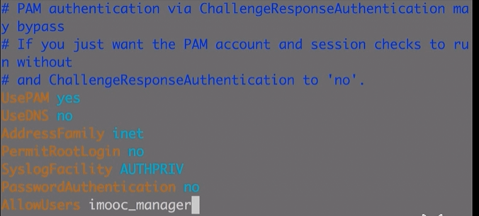

# 如果我有一台服务器，我会怎么部署

linux 常规命令

| 命令名                        | 作用                         |     |
| ----------------------------- | ---------------------------- | --- |
| df -h                         | 面板使用情况                 |     |
| fdisk -l                      | 数据盘                       |     |
| adduser hanbo_manager         | 添加用户                     |     |
| gpasswd -a hanbo_manager sudo | 给 hanbo_manager sudo 的权限 |     |
| ps -ef \| grep visudo         | 查到 visudo 的进程号         |     |
|                               |                              |     |

| 命令行            | 作用         |     |
| ----------------- | ------------ | --- |
| useradd -m 用户名 | 添加用户     |     |
| passwd 用户名     | 设置密码     |     |
| userdel -r 用户名 | 删除用户     |     |
| cat /etc/passwd   | 查看所有用户 |     |
| cat /etc/group    | 查看用户组   |     |
|                   |              |     |
|                   |              |     |

centos7 操作 ssh/sshd 服务命令

| 命令行                         | 作用     |     |
| ------------------------------ | -------- | --- |
| systemctl status sshd.service  | 查看状态 |     |
| systemctl start sshd.service   | 启动服务 |     |
| systemctl restart sshd.service | 重启服务 |     |
| systemctl enable sshd.service  | 开机自启 |     |
|                                |          |     |

登录远程服务器

```shell
ssh -p 39999 elaine@47.102.152.19
```

修改环境变量的方法

https://blog.csdn.net/u011630575/article/details/49839893

方法二：

在用户目录下的.bash_profile 文件中增加变量（对单一用户有效（永久的））

用 vim 修改完 .bash_profile 文件后

使用 source .bash_profile 就能让修改后的文件生效

如何在服务器上做配置，先登录 liunx 服务器，

给自己设立一个超级管理员 johan

```shell
adduser johan
```

如何查看用户信息呢？

```shell
cat /etc/passwd
```

但是我们没有设置超级管理员 johan 的密码

```shell
passwd johan
```

给他权限

```shell
sudo visudo
```

在 `Allow root to run any commands anywhere` 处添加

```
johan   ALL=(ALL)       ALL
```

然后我们需要给我们的服务添加无密码登录服务

### ssh 密钥认证免密登录

先给他设置个代理人 elaine，不要通过 root 来操作，而是给 代理人（elaine）超级管理员权限，右他来帮忙做操作。

接着登录 elaine 账号，生成公钥私钥

```shell
ssh-keygen -t rsa -b 4096 -C "t511069160@qq.com"
# 结果
# The key fingerprint is:
# SHA256:WA1p8jpMzSG/TKsZc5QlFbQIHfEh34bsCkblwHBKf9c t511069160@qq.com
# The key's randomart image is:
# +---[RSA 4096]----+
# |    oo+.**=.     |
# |   . ++=*O.*     |
# |    . oO==O E    |
# |     ..+Oo .     |
# |     o+=So.      |
# |     .*.=.       |
# |       B.        |
# |      o          |
# |                 |
# +----[SHA256]-----+
```

生成后开启代理

```shell
 eval "$(ssh-agent -s)"
# Agent pid 11429
```

将钥匙添加至 id_rsa 中

```shell
ssh-add ~/.ssh/id_rsa
# Identity added: /home/elaine/.ssh/id_rsa (/home/elaine/.ssh/id_rsa)
```

进入 .ssh 文件，编辑生成 authorized_keys 文件

```shell
vi authorized_keys
```

然后将本地的公钥拿来

```shell
# window 在C:\Users\Administrator\.ssh 文件中
.ssh cat id_rsa.pub
ssh-rsa AAAAB3NzaC1yc2EAAAADAQABAAABAQCmjUTPsPm7VAyAFynI8KDh/VUt1vD6/LrjAErSWcRUxDRDfDcNS8G5T+kU+89erxXSV4fulCpGBCa0cnzBvz4IdhMaASBE60DdMXzUE7ITCtKVWr2VHJpmqXnA75VXL4wS9e90z2+tShB++BcPlYGEfTugqiMfqpRJXn0S9QlAQ9GWGUnBKEiS3s58LRAM0m/GfQ9ad3xlf7EeMVCdXKy6+BKQx3FnYEA44hTiwxKZPh/hzb/K2zUHygVb04D8/NDw6270FVHNfwcmRWh+wMqJy5hCtKEKc9LoEtgo2CgOdyg7Z9Mtc/FtN8CKIT5UCU0DgIM5t9DEi8Ll5lbA9D5L t511069160@qq.com

```

复制本地公钥，拷贝到 authorized_keys 中

接着修改 authorized_keys 的权限，`chmod 600 authorized_keys` ，并重启服务 `sudo systemctl restart sshd.service` （centos7 重启服务）。重开一个终端，看看是否需要登录

### 修改默认端口（提高安全性）

默认端口是 22，提高安全性，肯定不能用默认的端口，那么就需要在配置里修改

登录 elaine 超级管理员账号，

sudo vi /etc/ssh/sshd_config

修改端口号

port 22

修改为

port 39999

拉倒最下面

修改以下配置



PS： 需要注意的是，你如果买的是阿里云的服务器，需要在控制面板中的安全组里添加入方向端口


配置 iptable 防火墙

**检查安全组设置**

添加 端口配置

firewall 添加 443 端口

```shell
firewall-cmd --list-ports
#output 80/tcp
firewall-cmd --zone=public --add-port=443/tcp --permanent
firewall-cmd --reload
```

### 安装所需环境

先更新 yum

```shell
sudo yum update && sudo yum upgrade
```

如果你在 ubuntu 操作系统下，请用 apt-get 来代替

下载所需要的东西

```shell
sudo yum install vim git openssl libssl-dev wget curl git
sudo yum groupinstall "Development Tools"
# 下载 nvm
curl -o- https://raw.githubusercontent.com/nvm-sh/nvm/v0.35.3/install.sh | bash
```

https://github.com/nvm-sh/nvm

将 nvm 命令行配置进 环境中

```shell
nvm install v12.18.0
```

### 上传代码实现一个小服务

在本地新建一个新的 js 文件

```javascript
const http = require('http');

const HomePage = `
<!DOCTYPE html>
<html>
  <head>
    <meta charset='utf-8'>
    <title>部署上线测试代码</title>
    <style type="text/css">
        * { padding: 0; margin: 0; }
        body { padding: 30px 0; text-align: center; font-size: 16px; background-color: #333; }
        h1, h2 { color: #fff; }
        nav { margin-top: 20px; }
        a { color: #ccc; text-decoration: none; }
        a:hover { text-decoration: underline; }
    </style>
  </head>
  <body>
    <h1>Hello word</h1>
    <h2>代码上线我最棒</h2>
  </body>
</html>
`;

http.createServer((req, res) => {
    res.statusCode = 200;
    res.setHeader('Content-Type', 'text/html');
    res.end(HomePage);
}).listen(8001, () => {
    console.log('Server Running At 8001');
});
```

在服务器端下载 lrzsz

```shell
sudo yum install -y lrzsz
```

通过 lrzsz 上传 本地写好的 node 服务

```shell
rz
```

上传至 johan 目录的根目录下，因为允许访问的是 8001 端口，所以需要到阿里云服务器上配置 出入安全组

设置完后回到服务器上启动 node 服务

```shell
node app.js
```

就能直接访问了

但是为了让我们能在启动服务的同时再才做服务器，需要一个专门管理启动服务的包，那就是 pm2 ，可以理解为管家，我要启动、停止、重启服务，只用告诉它，它会去做

```shell
npm i pm2 -g
pm2 start app.js
```

我们已经启动了一个服务了，一个很简单的，只有一个文件的服务，但是如果是 5 个项目呢？如果 5 个项目中有前端和后端该怎么做呢？

通过 nginx 代理 ，访问不同的二级域名，nginx 将用户的访问反向代理到 内部服务

图片缺失

也就是说，用户访问 azhubaby.com , nginx 会将请求转发给服务器内部的 8001 的服务，访问 fe.azhubaby.com ，nginx 会将请求转发给服务器内部的 8002 端口的服务，以此类推

而为什么要有反向代理，因为用户只访问 80 端口，他们不会再后面输入端口号，但是我们是开发者，我们可以释放很多接口，所以反向代理是为了方便用户，nginx 转发用户请求

既然我们知道了整个流程的理论知道，那么就开干，开干之前先买好域名和备案

### 配置 Nginx 实现反向代理

先停止服务器中的 apache2 或者 apache ，再删除它

```shell
sudo service apache2 stop
sudo service apache stop
update-rc.d -f apache2 remove
sudo yum remove apache2
```

更新下包列表

```shell
sudo yum update
```

下载 nginx

```shell
sudo yum install nginx
```

进入 etc/nginx

```shell
cd /etc/nginx
```

进入 conf.d 中

```shell
cd conf.d
```

在这里新建配置文件（以后的配置指向这里，一个文件代表一个服务代理）

```shell
vi azhubaby-com-8081.conf
# 在里面配置
upstream azhubaby {
   server 127.0.0.1:8081;
}

server {
   listen 80;
   server_name 47.102.152.19;

   location / {
        proxy_set_header X-Real-IP $remote_addr;
        proxy_set_header X-Forward-Fr $proxy_add_x_forwarded_for;
        proxy_set_header Host $http_host;
        proxy_set_header X-Nginx-Proxt true;

        proxy_pass http://azhubaby;
        proxy_redirect off;
   }
}
```

检查 nginx 是否配置正确

```shell
sudo nginx -t
```

### 服务器配置安装 MongoDB

安装（参考官网：https://docs.mongodb.com/manual/tutorial/install-mongodb-on-red-hat/）

新建一个文件

```shell
vim /etc/yum.repos.d/mongodb-org-4.2.repo
```

配置 yum 源

```shell
[mongodb-org-4.2]
name=MongoDB Repository
baseurl=https://repo.mongodb.org/yum/redhat/$releasever/mongodb-org/4.2/x86_64/
gpgcheck=1
enabled=1
gpgkey=https://www.mongodb.org/static/pgp/server-4.2.asc
```

安装 MongoDB（社区版）

```shell
sudo yum install -y mongodb-org
```

查看版本

```shell
mongo --version
```

成功

我们现在需要做的是把本地的 mongo 数据导出上传至服务器上，该怎么做呢？

先在本地连接数据库，进入到 mongodb 的安装目录，启动 `mongod.exe` 文件，

接着备份数据

```shell
mongodump -h 127.0.0.1:27017 -d lipingerblog -o lipingerblog-backup
```

但可惜的是，我的数据库是 mysql 的，所以，我们这次部署 mysql 的数据库，先导出

```shell
 mysqldump -u root -p lipingerblog > lipingerblog_bak.sql
```

登登，导出成功。

随便记录下如何导入数据库

```shell
mysql -u root -p 123456 lipingerblog < lipingerblog_bak.sql
```

现在我们需要做的是，在服务器上安装 mysql，并导入数据库，让它跑起来

https://www.jianshu.com/p/224a891932d8

附上安装教程，但是要记住一点，进入 mysql 后，记得每一行命令之后要加`;` ，不然它会理解为是一个命令

而且因为我用 johan 这个账号来下载 mysql，所以有必要用 sudo

mysql 常用命令

| 命令                         | 意义             | 注释                     |
| ---------------------------- | ---------------- | ------------------------ |
| mysql -p root -u             | 连接数据库       |                          |
| show databases;              | 查看数据库       | 注意：`;` 表示结束的意思 |
| use lipingerblog；           | 使用 XX 数据库   |                          |
| select database();           | 查看当前数据库   |                          |
| show tables;                 | 查看数据库表     |                          |
| show full columns from user; | 查看表中所有字段 |                          |
| flush privileges;            | 刷新数据库       |                          |
| exit;                        | 退出             |                          |
|                              |                  |                          |

redis 的安装

https://redis.io/download

将 redis 文件放入 一个指定的文件里，好做管理

然后将本地代码提交到 git 仓库，

因为之前在服务器上已经生成 ssh，把 ids.rsa.pub 上传至 github 惭愧

这样你在服务器上就可以拉到 github 上的代码
