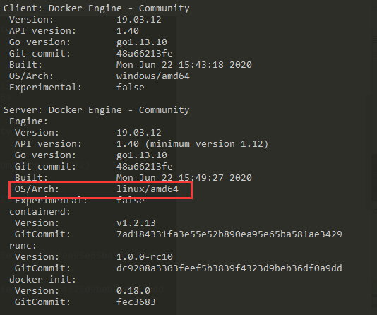
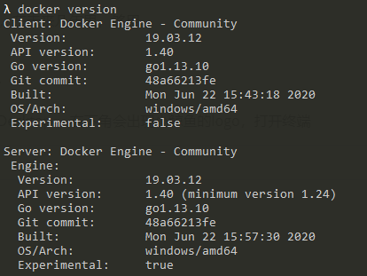

# 如何安装 docker

具体可看 [这篇文章](https://zhuanlan.zhihu.com/p/85048683) ,19 年 10 月份写的，在未来几年里，够用。

也可以直接去官网的[下载地址](https://download.docker.com)下载

值得注意的是，必须要开启 **Hyper-V**

下载安装好 docker 后，运行 Docker Desktop ，右下角会出现小鲸鱼的 logo，打开终端

```shell
docker version
```



从打印出的信息中我们可以看出，它的 Server 里的 OS（操作系统）是 linux，也正式我们想要的，如果是 window，需要切换小鲸鱼图标

看到 Switch to Window containers ... 说明是 Liunx 版本

看到 Switch to Linux containers ... 说明是 window 版本


如下是 Docker 切换成 window 后的样子（看 OS/Arch）



点击小鲸鱼，登录账号，以后发布自己的 docker 镜像就可以命令行直接推送至 docker hub，原理跟 git 一样
