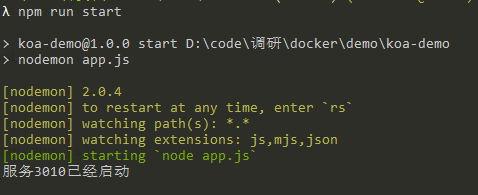
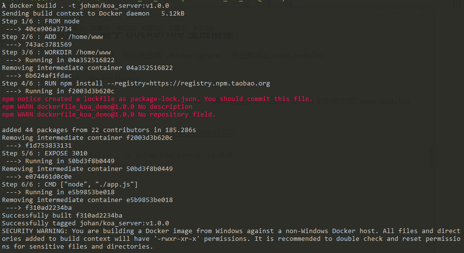
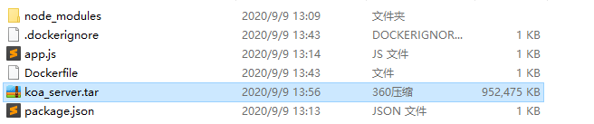
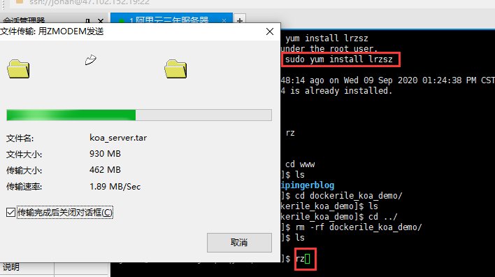
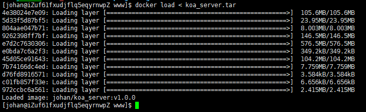
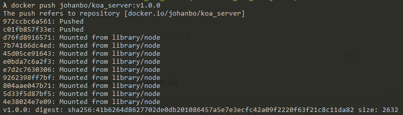
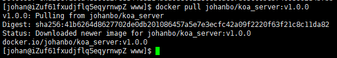

# 实战：dockerfile 最小实践——koa 为例

## 前言

最小实践，意味着将链路打通，站在更高的层面看问题，问题就变得清晰，这一章，我将带你实现一个最简单的 koa 服务，并将其部署至服务器上。

先决知识：对[docker 有一定的了解](./docker基本介绍.md)

## 实现思路

第一步：先启动一个 koa 应用，

第二步：再生成一个 dockerfile ，并编写它

第三步：基于 dockerfile 生成镜像（docker build）

第四步：基于此镜像生成（run）一个容器，检查在本机上是否跑的通

第五步：如果通，就导出此镜像

第六步：xshell 连接服务器上（假设服务器上已安装 docker），导入此镜像，通过此镜像生成一容器

这就是最小实现

这里还有一种实现方式：

在第五步时，把它发布到远端仓库，第六步，从远端拉取到镜像，但缺点是，你的镜像要公开（只有一个私有名额）

## 第一步：先启动一个 koa 应用

新建一个 dockerfile_koa_demo 文件，npm init -y 生成 package.json。下载 koa 包，新建 app.js

```shell
mkdir dockerfile_koa_demo
cd dockerfile_koa_demo
npm init -y
npm i koa --save
touch app.js
```

再编写 app.js

```javascript
const Koa = require('koa');

const app = new Koa();

app.use(async (ctx) => {
    ctx.body = 'hello, docker';
});

app.listen(3010, () => {
    console.log('3010端口已启动');
});
```

修改 package.json 的 script

```json
...
"scripts": {
    "start": "nodemon app.js"
},
...
```

启动脚本

```shell
npm run start
```

看到如下图所示：



浏览器访问正常

## 第二步：写个 Dockerfile 文件

新建一个 Dockerfile 文件

```shell
touch Dockerfile
```

编写 Dockerfile

```dockerfile
# base image
# FROM
FROM node

# 复制文件到容器
ADD . /home/www

# 进入工作目录
WORKDIR /home/www

# 安装项目依赖包
RUN npm install --registry=https://registry.npm.taobao.org

# 暴露 端口
EXPOSE 3010

# 开始命令
CMD ["node", "./app.js"]

```

第二步写完了

## 第三步：基于 dockerfile 生成镜像

为了加快构建速度，我们先生成 `.dockerignore` ，并往里写上 `node_modules`

```shell
touch .dockerignore
```

在 `.dockerignore` 里写入 `node_modules` ，意思是说当你 `docker build` 的时候忽略 `node_modules` 文件，加快构建速度

通过命令行生成镜像，命名 johan/koa_server:v1.0.0

```shell
docker build . -t johan/koa_server:v1.0.0
# -t 就是给镜像起名
```

效果如下图所示：



查看镜像是否有了

```shell
docker images
```

## 第四步：基于此镜像生成一容器

命令行生成一容器

```shell
docker run -d --name koa_server_container -p 3010:3010 johan/koa_server:v1.0.0
# -d 后台运行
# --name 给容器起名字
# -p 本机端口隐射镜像中的端口
```

查看镜像是否生成

```shell
docker ps -a
```

在浏览器中输入`http://localhost:3010/` ,bingo

## 第五步：导出此镜像

```shell
docker save johan/koa_server:v1.0.0 > koa_server.tar
```



## 第六步：在服务器上跑通

这里我们假设服务器上已经安装了 docker 以及 lrzsz 包（本文具体不展开）

通过 xshell 连接服务器，通过命令 rz 上传 tar 包

```shell
rz
```



解开此压缩包（导入）

```shell
docker load < koa_server.tar
```



基于此容器生成容器

```shell
docker run -d --name koa_server_container -p 3010:3010 johan/koa_server:v1.0.0
```

并查看跑通的容器

```shell
docker ps -a
```

在浏览器中输入域名，bingo

以上就是一个 `dockerfile` 的最小实现，是不是很简单。当然，你可以再第五步时将镜像上传至`docker hub`，第六步从 `dockerfile` 拉取镜像，再生成容器。如下

## 另一种方法第五步：上传镜像

命令行登录 dockerhub（首先要先注册）

```shell
docker login
```

给镜像命名

```shell
docker tag johan/koa_server:v1.0.0 johanbo/koa_server:v1.0.0
```

将镜像上传至 docker hub

```shell
docker push johanbo/koa_server:v1.0.0
```



## 另一种方法第六步：拉取镜像

登录服务器，并拉取镜像

```shell
docker pull johanbo/koa_server:v1.0.0
```



> **注意**：这里需要打标签，否则会默认拉取 latest

启动容器

```shell
docker run -d --name koa_server_container -p 3010:3010 johan/koa_server:v1.0.0
```

在浏览器中输入域名，bingo

> 注意：服务器开发端口需要去云服务商那里开发相应端口（安全组配置规则）

## 后续

你可以在 `dockerfile` 里配置你所需的环境变量，镜像生成的容器是个 "mini 服务器"，怎么倒腾都行，和整个服务器没有关系，所以你的应用不受环境影响。

在这里说一个痛点：即使你解决了环境问题，但是 CICD 也是个问题，如何更快捷的集成呢？接下来的一节我会介绍下，docker 与 jenkins 的结合，通过 docker 生成 jenkins，jenkins 赋能 CICD
