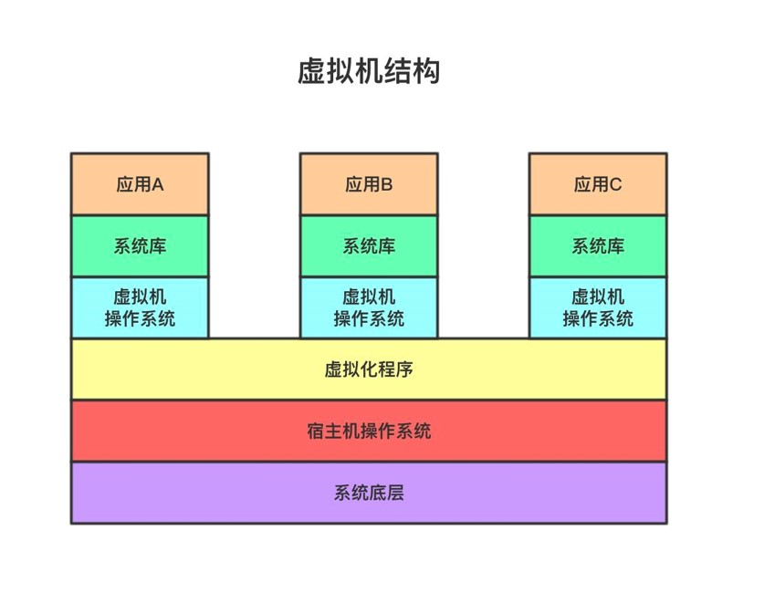
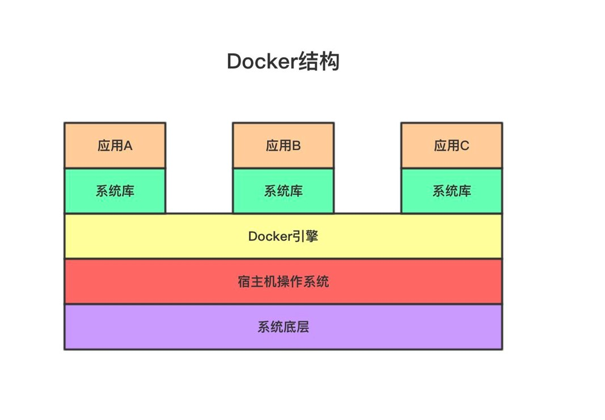

# 李瓶儿讲docker

很多人一开始讲 docker ，按照定义，解释，介绍，举例的方式来讲解，这就好比在《金瓶梅》里和西门庆说道理。

没看过《金瓶梅》的人都知道，性 是这部小说中的核心，引起 性 的是欲望，那么 docker 的出现，也总有一个理由吧，那就是资源资源的浪费，请看结构图，

一个虚拟机就以为有一个操作系统，而一个操作系统所需要的内容很多，一个服务器上可以安装多额虚拟机，而每创建一个虚拟机就意味着生成一个操作系统，大多数操作系统的功能是通用的，例如。。。

docker 通过 namespace 和 ctrol group 等底层技术实现同一个服务器上容器之间的隔离。并创造了2个新的名词，镜像和容器，加上借鉴了 git 的仓库概念，构成了docker核心的基础三大将。

你可以把一个服务器理解为一艘（运输）船，容器（container）就是一个个集装箱，

教程其实就是对 docker 的总结

