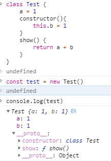

# Class 类

ES6 转 ES5 [babel 工具](https://babeljs.io/repl/#?browsers=&build=&builtIns=false&corejs=3.21&spec=false&loose=false&code_lz=Q&debug=false&forceAllTransforms=false&shippedProposals=false&circleciRepo=&evaluate=true&fileSize=false&timeTravel=false&sourceType=module&lineWrap=false&presets=es2015%2Creact%2Cstage-2&prettier=false&targets=&version=7.17.6&externalPlugins=&assumptions=%7B%7D)

问题：

为什么子类的构造函数，一定要调用`super()`？

-   ES6 在继承中强制要求，必须在子类调用 super（默认调用），因为子类的 this 是由父类得来的
-   super 等价于 parent.prototype.constructor.call(sub)
-   super 即可以作为函数调用，又可以作为对象调用
    -   函数：只能在 constructor 内部调用
    -   对象：别的方法内调用

## super

super 关键字用于访问和调用一个对象的父对象上的函数

`super.prop`和`super[expr]`表达式在[类](https://developer.mozilla.org/en-US/docs/Web/JavaScript/Reference/Classes)和[对象字面量](https://developer.mozilla.org/en-US/docs/Web/JavaScript/Reference/Operators/Object_initializer)任何[方法定义](https://developer.mozilla.org/en-US/docs/Web/JavaScript/Reference/Functions/Method_definitions)中都是有效的。

### 语法

```javascript
super([arguments]);
// 调用 父对象/父类 的构造函数
super.functionOnParent([arguments]);
// 调用 父对象/父类 上的方法
```

### 描述

在构造函数中使用时， super 关键字将单独出现，并且必须在使用 this 关键字之前使用。super 关键字也可以用来调用父对象上的函数

class 与 prototype 继承

之前讲原型的时候说过，基于原型（prototype）的继承是继承了结构，数据，行为；而 class 的继承，继承的是行为和结构，但没有继承数据。并且我们举了个例子

```javascript
class Test {
    a = 1;
    constructor() {
        this.b = 1;
    }
    show() {
        return a + b;
    }
}
const test = new Test();
```

**为了迎合 class 的基本行为， prototype 继承数据的能力被屏蔽了**



而如果想要让继承者继承数据，就要在 prototype 上写

在 React 源码中，也有这样的代码出现。React 有两种写法（createElement 已经摒弃），基于类的写法和基于函数的写法。如何判断两者呢?

```javascript
class Component {
    constructor() {}

    componentDidMount() {}

    setState(partialState) {}

    render() {}
}
// 给 Componet 组件的原型上添加属性，让其继承，来区分函数还是类
Component.prototype.isReactComponet = true;
```

```javascript
// src/index.js
...
const createElement = (type, props = {}, ...children) => {
    /**
     * 如果是类组件
     * 1.创建一个实例
     * 2.调用实例的 render 方法
     */
    if (type.prototype && type.prototype.isReactComponent) {
        const componentInstance = new type(props);

        return componentInstance.render();
    }
    //如果是函数组件，那么调用它，并返回执行结果
    if (typeof (type) == 'function') {
        return type(props);
    }
    return h(type, { props }, children);
};
...
```

ES6 的 class 转换为 ES5 中的 prototype 具体代表着什么

```javascript
const name = 'johan';
const obj1 = {
    sayhello: function () {
        console.log('sayhello');
    },
    verson: 'v1',
};

class A {
    constructor() {
        this.name = name;
        this.obj1 = obj1;
    }
    sayA() {
        console.log('sayA');
    }
}
const a = new A();
a.sayA(); // sayA 来源自A的原型上
a.name; // johan
a.obj1.verson(); //  v1
a.obj1.sayhello(); // sayhello
```

new 的意思就是实例化，实例化代表

可以看出，sayA 方法是公共方法，而

```javascript
const name = 'johan';
function A() {
    this.name = name;
}
A.prototype.sayA = function () {
    console.log('sayA');
};
```

PS: 我们约定俗成，首字母大写的为构造函数

## 参考资料

-   [ES6 class 的静态方法、属性和实例属性](https://blog.csdn.net/qq_30100043/article/details/53542966)
-   [你需要知道的 JavaScript 类(class)的这些知识](https://segmentfault.com/a/1190000021285915)
-   [javascript-es6-中最容易誤會的語法糖-class-基本用法](https://medium.com/enjoy-life-enjoy-coding/javascript-es6-%E4%B8%AD%E6%9C%80%E5%AE%B9%E6%98%93%E8%AA%A4%E6%9C%83%E7%9A%84%E8%AA%9E%E6%B3%95%E7%B3%96-class-%E5%9F%BA%E6%9C%AC%E7%94%A8%E6%B3%95-23e4a4a5e8ed)
