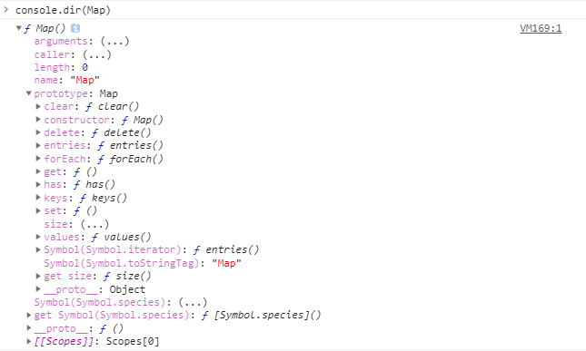

# Map&Set

以前使用集合，多数情况下会直接用 Object 代替，ES6 新增了两个特性，Map 和 Set，他们是对 JavaScript 关于集合概念的补充

## Map

### 前言

为什么会有 Map？像对象 Object，是由 key:value 集合组成的，但是**key 只能是字符串**。map 的作用就是可以用其他类型的数据做 key。

例如

```javascript
var map = new Map();
map.set(1, 2);
map.set({ name: 'johan' }, true);
// set(key, value)
```

### Map 是什么

`Map` 在其他语言中被翻译为字典，在 ES6 规范中引入了新的数据类型 `Map` 就是对字典这类数据结构的一种补充。

`Map` 是一组键值对的结构，具有极快的查找速度。数据结构是 hash-table（哈希表）

Map 是一个带键的数据项的集合，就像一个 Object 一样，但是它们最大的差别是 Map 允许任何类型的键（key）

### 方法与属性

-   new Map() —— 创建 map
-   map.set(key, value) —— 根据键存储值
-   map.get(key) —— 根据键来返回值，如果 map 中不存在对应的 key，则返回 undefined
-   map.has(key) —— 如果 key 存在则返回 true，否则返回 false
-   map.delete(key) —— 删除指定键的值
-   map.clear() —— 清空 map
-   map.size —— 返回当前元素个数

### 使用方法

```javascript
const m = new Map([
    ['Johan', 26],
    ['Elaine', 26],
    ['Bob', 12],
]);
m.get('Johan'); // 26
```

### 算法中是使用

最常见的是求两数之和和三数之和。无论是哪一种，本质都是目标数与循环数的差

例题：https://leetcode-cn.com/problems/two-sum/

> 给定一个整数数组 `nums` 和一个整数目标值 `target`，请你在该数组中找出 **和为目标值** _`target`_ 的那 **两个** 整数，并返回它们的数组下标

示例 1：

```
输入：nums = [2,7,11,15], target = 9
输出：[0,1]
解释：因为 nums[0] + nums[1] == 9 ，返回 [0, 1] 。
```

```javascript
/**
 * @param {number[]} nums
 * @param {number} target
 * @return {number[]}
 */
var twoSum = function (nums, target) {
    let len = nums.length;
    let map = new Map();
    for (let i = 0; i < len; i++) {
        const diff = target - nums[i];
        if (map.has(diff)) {
            return [map.get(diff), i];
        }
        map.set(num[i], i);
    }
};
```

### 窥视 Map

之前在将 Promise 时，我们已经自己手写了 Promise，那么 Map（字典）我们是否也能手写一个呢？

老规矩，先打印它具体有哪些参数

```javascript
console.dir(Map);
```



肉眼分析可得，它是基于 Object 创建的对象实例（`__proto__`指向 Object，不懂的可以去 JavaScript 中的原型篇中了解一二），其次它的原型上有`clear`、`delete(key)`、`entries`、`forEach(callbackFn[, thisArg])`、`get(key)`、`set(key, valye)`、`has(key)`、`keys`、`values`、`[@@iterator]` 等十个方法，还有两个原型属性 `constructor` 和 `size`。各个方法和属性对应的解释不做说明，懂的人自然懂，不懂的可以去查

我们手写一个 Map

```javascript
function MyMap() {

}
MyMap.prototype = {
    constructor: MyMap;
    clear: function() {

    },
    delete: function(key) {

    },
    entries: function(key) {

    },
    forEach: function(callback) {

    },
    get: function(key) {

    },
    set: function(key, value) {

    },
    has: function(key) {

    },
    values: function(key) {

    }
}
var m = new Map([])
```

### WeakMap

与 Map 类似，但又几点区别：

-   WeakMap 只接受对象作为 key，如果设置其他类型的数据作为 key，会报错

Map 与 Object 的区别

-   Map 与 Object 都可以存取数据，Map 适用于存储需要**常需要变化（增减键值对）或遍历**的数据集，而 Object 适用于存储**静态（例如配置信息）**数据集
-   Object 的 key 必须是 String 或 Symbol 类型，而 Map 无此限制，可以是任何值
-   Map 可以很方面的取到键值对数量，而 Object 需要用额外途径

## Set

Set 作为最简单的集合，有着如下几个特点：

-   Set 可以存储任何类型的值，遍历顺序与 插入顺序相同
-   SET 内无重复的值

`Set` 和 `Map` 类似，也是一组 key 的集合，但不存储 value 。由于 key 不能重复，所以，在`Set`中，没有重复的 key

## WeakMap + WeakSet

主要特点是弱引用

相比于 Map 和 Set 的强引用，弱引用可以令对象在“适当”情况下正确被 GC 回收，减少内存资源浪费

但由于不是强引用，所以无法进行遍历或取得值数量，只能用于值的存取（WeakMap）或是否存在值的判断（WeakSet）

### 参考资料

-   [Map and Set（集合和映射）](https://zh.javascript.info/map-set)
-   [「 Map 最佳实践」什么时候适合使用 Map 而不是 Object](https://mp.weixin.qq.com/s/ax-Lec-wam0pptpRTH5Log)
-   [Map 和 Set](https://www.liaoxuefeng.com/wiki/1022910821149312/1023024181109440)
