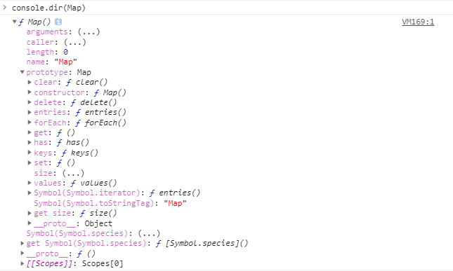

# Map

### 前言

`Map` 在其他语言中被翻译为字典，在ES6规范中引入了新的数据类型`Map` 就是对字典这类数据结构的一种补充。

### Map是什么

`Map` 是一组键值对的结构，具有极快的查找速度

### 使用方法

```javascript
const m = new Map([['Johan', 26], ['Elaine', 26], ['Bob', 12]]);
m.get('Johan') // 26
```


### 窥视Map

之前在将Promise时，我们已经自己手写了Promise，那么Map（字典）我们是否也能手写一个呢？

老规矩，先打印它具体有哪些参数

```javascript
console.dir(Map)
```



肉眼分析可得，它是基于Object创建的对象实例（`__proto__`指向Object，不懂的可以去Javascript中的原型篇中了解一二），其次它的原型上有`clear`、`delete(key)`、`entries`、`forEach(callbackFn[, thisArg])`、`get(key)`、`set(key, valye)`、`has(key)`、`keys`、`values`、`[@@iterator]` 等十个方法，还有两个原型属性 `constructor` 和 `size`。各个方法和属性对应的解释不做说明，懂的人自然懂，不懂的可以去查

我们手写一个Map

```javascript
function MyMap() {
    
}
Map.prototype = {
    clear: function() {
        
    },
    delete: function(key) {
        
    },
    entries: function(key) {
        
    },
    forEach: function(callback) {
        
    },
    get: function(key) {
        
    },
    set: function(key, value) {
        
    },
    has: function(key) {
        
    },
    values: function(key) {
        
    }
}
var m = new Map([])
```


