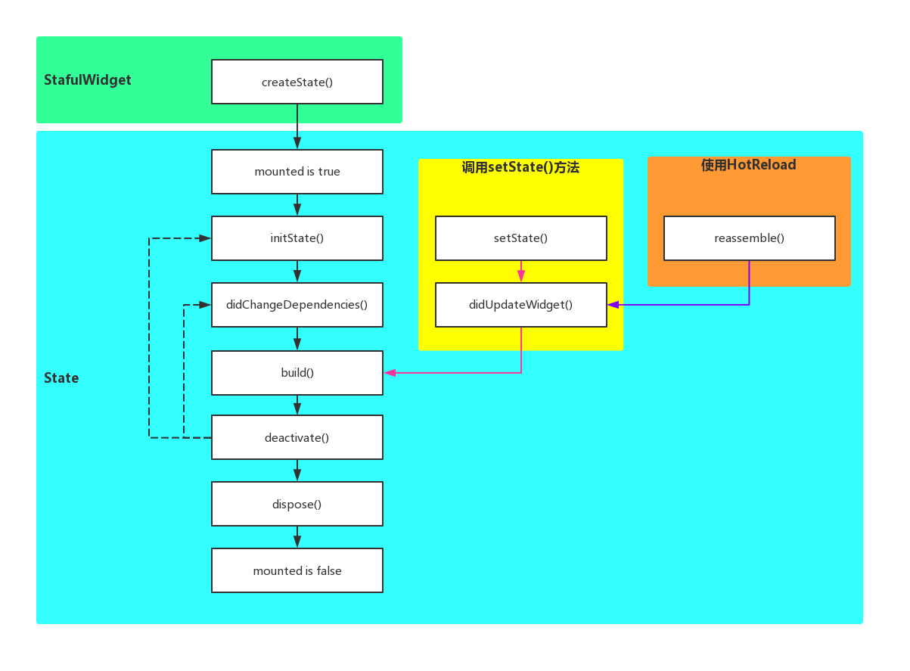

# StatefulWidget

statefulWidget实现步骤

1.首先继承StagefulWidget

2.实现createState()的放大，返回一个State


StatefulWidgetD 生命周期



```dart
class XXXState extends State<XXX> {

  @override
  void initState() {
    // TODO: implement initState
    super.initState();
    print("initState");
    context.runtimeType;
  }

  @override
  void didChangeDependencies() {
    // TODO: implement didChangeDependencies
    super.didChangeDependencies();
    print("didChangeDependencies");
  }
  
  @override
  void didUpdateWidget(MyApp oldWidget) {
    // TODO: implement didUpdateWidget
    super.didUpdateWidget(oldWidget);
    print("didUpdateWidget");
  }


  @override
  Widget build(BuildContext context) {
    print("build");
    return ...
  }

  @override
  void dispose() {
    // TODO: implement dispose
    super.dispose();
    print("dispose");
  }

  @override
  void reassemble() {
    // TODO: implement reassemble
    super.reassemble();
    print("reassemble");
  }

}
```


我有疑问

StatefulWidget是有状态的，有state

而StatelessWidget是无状态的

呢么 StatelessWidget 是无状态组件吗


StatefulWidget是由State的，StatelessWidget是无State的


五类Widget

基础 Widget

手势识别 Widget

布局 Widget

容器类 Widget

可滚动 Widget


