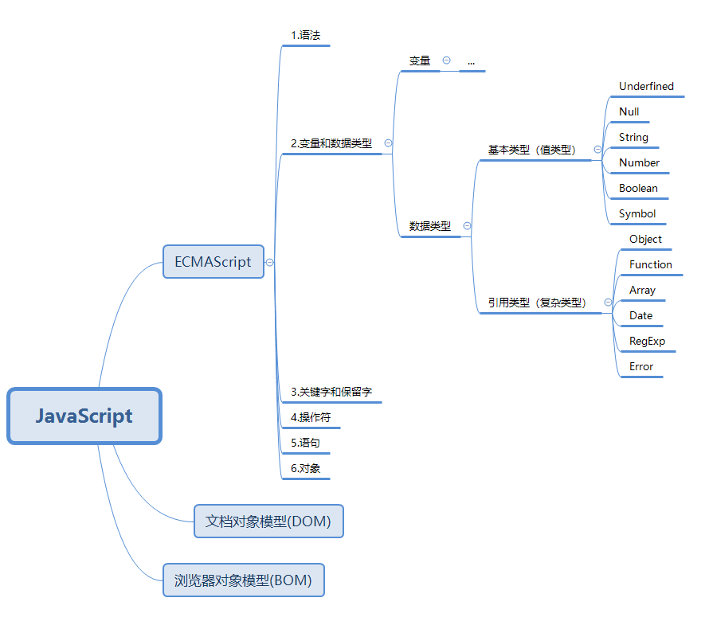
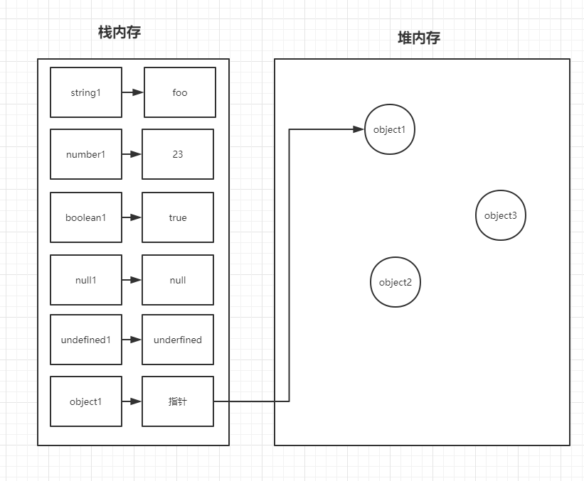

# JavaScript 由什么组成

这是一个基础结构问题，一个完整的 JavaScript 包括：ECMAScript 、文档对象模型（DOM）、浏览器对象模型（BOM），本章正是研究的 ECMAScript 。如果对 DOM 感兴趣，请移步——[DOM](../Browser/DOM.md) 。如果对 BOM 感兴趣，请移步——[BOM](../Browser/BOM.md)。

ECMAScript 规定这门语言由以下组成：

1.  语法
2.  变量和数据类型
3.  关键字和保留字
4.  操作符
5.  语句
6.  对象

也就是说，这六大模块组成了这门语言，就好比你学习英语，要掌握基本的单词和语法，才能说基础英语

这六大支柱中，像语法、变量和数据类型、关键字和保留字、操作符、语句都是极好理解的，但是对象却让很多人绝望，所以对象是学习 JavaScript 最重要的知识。毕竟 JavaScript 一切皆对象

## JavaScript 的数据类型

**数据类型分为 基本类型 和 引用类型。**

基本类型在不同的书中叫法不同（基本类型/值类型/原始值/原始类型），当然引用类型的叫法也不同（复杂类型）

基本类型包含 `undefined类型`、`Null类型`、`String类型`、`Number类型`、`Boolean类型`、`Symbol类型`

引用类型是一种数据结构，在别的语言中被称为类，但是在 JavaScript 中实际上没有类（基于原型链继承 Object）。原生的引用类型有 `Object` 、`Function`、`Array` 、`Date`、`RegExp`、`Error`



JavaScript 内置了一些构造函数和对象，详情的可以到 MDN（[JavaScript 的内置函数](https://developer.mozilla.org/zh-CN/docs/Web/JavaScript/Data_structures)）上看一眼，其最主要的九个原生对象构造函数：

-   String()
-   Number()
-   Boolean()
-   Object()
-   Array()
-   Function()
-   Date()
-   RegExp()
-   Error()

两个比较重要的对象：

-   Math
-   JSON

以上就是 ECMAScript 中最重要的东西。

注意：JavaScript 内置对象有很多，具体参考 MDN 的这篇文章——[JavaScript 标准内置对象](https://developer.mozilla.org/zh-CN/docs/Web/JavaScript/Reference/Global_Objects)

我们可以看一下以下代码：

```javascript
var string1 = 'foo';
var string2 = String('foo');
var number1 = 10;
var number2 = Number('10');
var boolean1 = true;
var boolean2 = Boolean('true');

console.log(typeof string1, typeof string2); // 输出 'string, string'
console.log(typeof number1, typeof number2); // 输出 'number, number'
console.log(typeof boolean1, typeof boolean2); // 输出 'boolean, boolean'

// 如果使用创建对象的构造函数和new关键字
var myString = new String('male');
var myNumber = new Number(23);
var myBoolean = new Boolean(false);
console.log(typeof myString, typeof myNumber, typeof myBoolean);
// object, object, object
```

我们看到如果使用字面量语法创建值，**那么值类型的输出结果就是值类型**；

如果使用 new 关键字创建 String()、Number()、Boolean() 值时，**创建的对象实际上是一个复杂对象**。

这说明 new 关键字做了一些手脚，至于它是怎么改变三个小兄弟的，可以跳转到——这里[new 改变了对象](./new 改变了对象.md)

## typeof 操作符

作用：返回正在使用的值的类型

```javascript
// 基本类型/值类型/原始值/原始类型	叫法不同意思一致
var null1 = null;
var undefined1 = undefined;
var string1 = 'foo';
var number1 = Number('10');
var boolean1 = Boolean('true');
var symbol1 = Symbol('foo');
console.log(typeof null1); // object, 需要注意
console.log(typeof undefined1); // undefined
console.log(typeof string1); // string
console.log(typeof number1); // number
console.log(typeof boolean1); // boolean
console.log(typeof symbol1); // symbol

// 引用类型/复杂值
var myString = new String('male');
var myNumber = new Number(23);
var myBoolean = new Boolean(false);
var myObject = new Object();
var myArray = new Array('foo', 'bar');
var myFunction = new Function('x', 'y', 'return x * y');
var myDate = new Date();
var myRegExp = new RegExp('\\bt[a-z]+\\b');
var myError = new Error('error');

console.log(typeof myString); // 输出 object
console.log(typeof myNumber); // 输出 object
console.log(typeof myBoolean); // 输出 object
console.log(typeof myObject); // 输出 object
console.log(typeof myArray); // 输出 object
console.log(typeof myFunction); // 输出 function 需要注意
console.log(typeof myDate); // 输出 object
console.log(typeof myRegExp); // 输出 object
console.log(typeof myError); // 输出 object
```

通过 `typeof` 操作符能判断出使用的值的类型。需要注意判断引用类型时的问题

1. null 类型会返回 object
2. new Function，返回的是 function

至于为什么？挖个坑，等有时间在研究

随便一说，这也是我们看很多源码或者自己写代码时常用 typeof 来判断 function 类型

```javascript
if (typeof XXX === 'function') {
    // 如果XXX是function的话做什么操作
}
```

> PS：在《JavaScript 启示录》里第一章第八节里说 RegExp() 的类型返回的是 function，但是我检验后发现并不是，我猜测是因为老版本的浏览器对 RegExp 的判断为 funtion，而我用的 chrome 浏览器（V8 引擎）表示 RegExp 的类型为 object

## 基本类型和引用类型的区别

**基本类型储存在栈内存中**

**引用类型储存堆内存中**

基本类型花销的内存小，所以可以直接拷贝

引用类型花销的内存大，所以拷贝地址



```javascript
// 案例1
var string1 = 'foo';
var string2 = string1;
string1 = 'bar';
console.log(string1, string2); // 输出 bar, foo

// 案例2
var object1 = {
    name: 'johan',
    age: 23,
};
var object2 = object1;
object1.name = 'elaine';
object2.age = 22;
console.log(object1, object2);
// 输出 { name: 'elaine', age: 23 } { name: 'elaine', age: 23 }
```

因为基本类型是存放在栈内存中，string1 赋值给 string2 后，相当于开了一个独立空间给 string2，string1 和 string2 是完全独立的两个个体，再给 string1 赋值什么，都与 string2 无关

而引用类型之所以叫引用类型（在学术上叫复杂类型或复杂值），因为对象的地址是引用的，Object 可以一直嵌套，Function 也可以嵌套很多很多层（回调函数），Array 可以变花样的做出三维数组之类，总之，对象值可以无限大。值越大，就越占内存，如果一个很大的值随意复制，那对使用者来说就是灾难（不知不觉中就占了很大的内存）。所以它不可能随意复制，而是用指针的方式来将对象指向同一个地址（这里可以衍生到[浅拷贝和深拷贝](./拷贝的秘密.md)）

当你创建一个 object1，就在堆内存中开辟一个内存。如果你赋值给 object2，其实就是把 object1 指向堆内存的地址复制给 object2，它们指向的是同一个地址。再在 object1 或者 object2 做修改的话，相当于在堆内存上做修改，无论 object1 修改还是 object2 修改都会改变

```javascript
var obj1 = {};
var obj2 = obj1;
obj1.name = 'elaine';
obj2.age = 23;
console.log(obj1); // { name: 'elaine', age: 22};
console.log(obj2); // { name: 'elaine', age: 22};
```

> 衍生思考：虽然说 JavaScript 的动态性很是方便，但是如果一些新手修改了对象类型的值而不告知，那么就成了灾难。因为动态性+全局作用域，所有变量命名就成了问题，所以一般的库都是用匿名函数立即执行来破局，再后面就有了 模块化的概念，其本质是为了解决变量命名、语言动态性的问题

光知道 JavaScript 的数据类型不够，我们需要准确定位每一个变量是什么数据类型才行

判断数据类型的方式常见的有三种

-   使用 typeof
-   使用 instanceof
-   使用 constructor
-   使用 Object.prototype.toString.call()

在 typeof 操作符中已经谈过，typeof 可以检测出 string、number、boolean、undefined 以及 function，而对于 null 和 对象则无法检测，所以就有了其他的运算符帮助我们实现

### instanceof 运算符

`instanceof ` 运算符用于检测构造函数的 `prototype` 属性是否出现在某个实例对象的原型链上

```javascript
function People(name, age) {
    this.name = name;
    this.age = age;
}

const elaine = new People('elaine', 23);
console.log(elaine instanceof People);
console.log(elaine instanceof Object);
```

instanceof 运算符能让我们找到它的爸爸是谁（谁制造了他，从生理上讲应该是妈妈是谁），以及它的祖宗十八代，这也是面试中常遇到的——[instanceof 的原理是什么](./原理/instanceof——找祖籍.md)

### constructor 构造器

`constructor` 是一种用于创建和初始化 `class` 创建的对象的特殊方法。请注意，它是方法（function）。就好比：

```javascript
function sayHello() {
    console.log('hello');
}
```

不要因为单词陌生误以为它是属性

语法：

```javascript
constructor([arguments]) { ... }
```

这里多说一句，常看见 React 中有这样表达式

```javascript
class HelloWorld extends React.Component {
    constructor(props) {
        super(props);
    }
}
```

这里的意思很明白，`HelloWorld` 组件继承了 `React.Component` 组件，`constructor（props）` 意味着调用了父类的构造函数，并将 props 传递给 HelloWorld，使用 `super` 是因为在派生类中，必须调用 `super` 才能使用 `this`，当然，这部分就关系到 class 的知识，感兴趣可以移步到——[Class 类](../ES6/Class.md)

说完题外话，我们继续来看 `constructor` 能检验数据类型吗？

```javascript
// 借 typeof 中的例子，直接打印看效果
// 基本类型
console.log(null1.constructor); // Cannot read property 'constructor' of null
console.log(undefined1.constructor); // Cannot read property 'constructor' of undefined
console.log(string1.constructor); // String() { [native code] }
console.log(number1.constructor); // Number() { [native code] }
console.log(boolean1.constructor); // Boolean() { [native code] }
console.log(symbol1.constructor); // Symbol() { [native code] }
// 引用类型
console.log(myString.constructor); // String() { [native code] }
console.log(myNumber.constructor); // Number() { [native code] }
console.log(myBoolean.constructor); // Boolean() { [native code] }
console.log(myObject.constructor); // Object() { [native code] }
console.log(myArray.constructor); // Array() { [native code] }
console.log(myFunction.constructor); // Function() { [native code] }
console.log(myDate.constructor); // Date() { [native code] }
console.log(myRegExp.constructor); // RegExp() { [native code] }
console.log(myError.constructor); // Error() { [native code] }
```

综上所述，constructor 对 underfined 和 null 无效。此外， constructor 的指针是可以改变的

```javascript
function Person() {}
function Student() {}
Student.prototype = new Person();
var student = new Student();
console.log(student.constructor); // Person() {}
```

具体我们在[原型链](./原型链.md)章做详细介绍

### Object.prototype.toString.call(source)

`toString()` 方法返回一个表示该对象的字符串

每个对象都有一个`toString()` 方法（继承自 Object）。

用它能真正做到对类型的检测

```javascript
// 继续引用上述例子
// 基本类型
console.log(Object.prototype.toString.call(null1)); //[object Null]
console.log(Object.prototype.toString.call(undefined1)); //[object Undefined]
console.log(Object.prototype.toString.call(string1)); //[object String]
console.log(Object.prototype.toString.call(number1)); //[object Number]
console.log(Object.prototype.toString.call(boolean1)); //[object Boolean]
console.log(Object.prototype.toString.call(symbol1)); //[object Symbol]
// 引用类型
console.log(Object.prototype.toString.call(myString)); //[object String]
console.log(Object.prototype.toString.call(myNumber)); //[object Number]
console.log(Object.prototype.toString.call(myBoolean)); //[object Boolean]
console.log(Object.prototype.toString.call(myObject)); //[object Object]
console.log(Object.prototype.toString.call(myArray)); //[object Array]
console.log(Object.prototype.toString.call(myFunction)); //[object Function]
console.log(Object.prototype.toString.call(myDate)); //[object Date]
console.log(Object.prototype.toString.call(myRegExp)); //[object RegExp]
console.log(Object.prototype.toString.call(myError)); //[object Error]
```

我们可以看到它返回 [object NativeConstructorName] 格式的字符串，它能清晰的判断我们所需要的原生构造函数，同样，它的缺点是不能检测非原生构造函数。

在 jquery 中的$.type() 是内部的原理用的就是 Object.prototype.toString.call()，让我们手写一个类型判断的小小工具库吧

```javascript
function isType(source) {
    const target = Object.prototype.toString.call(source);
    switch(target) {
        case "[object Null]":
            return 'null';
        case "[object Undefined]":
            return 'undefined';
        case "[object String]":
            return 'string';
        case "[object Number]":
            return 'number';
        case "[object Boolean]":
            return 'boolean';
        case "[object Object]":
            return 'object';
        case "[object Array]":
            return 'array';
        case "[object Function]":
            return 'function';
        case "[object Date]":
            return 'date';
        case "[object RegExp]";
            return 'regexp';
        case "[object Error]";
            return 'error'
    }
}

function getType(target) {
    return Object.prototype.toString.call(target);
}
```

这一节我们讲了 JavaSript 由那些组成，从语言上分它包括语法，变量和数据类型，关键字和保留字，操作符，语句，对象。从数据类型上分，它分为基本类型（简单类型/值类型）和引用类型（复杂类型）。基本类型由数字、字符串、布尔值（true|false）、null 值、undefined 值、Symbol（唯一值）。其他的所有制都是对象（引用类型基于对象）。而且，数字、字符串和布尔值“貌似”对象，因为他们拥有方法，但他们是不可变的。

我们还知道可以通过四种方式来判断数据类型，但有优缺点

| 名称                        | 能检测                                                         | 不能检测                                       |
| --------------------------- | -------------------------------------------------------------- | ---------------------------------------------- |
| typeof                      | string、number、boolean、undefined 以及 function               | null 以及除 function 外的对象，结果都为 object |
| constructor                 | string、number、boolean、array、object、function 以及 构造函数 | undefined、null。不安全，因为 指向可以改变     |
| instanceof                  | 准确地判断复杂引用数据类型                                     | 不能正确判断基础数据类型                       |
| Object.prototype.toString() | 内置构造函数函数                                               | 构造函数                                       |

我们知道

下一节，我们讲走进对象的世界，看看 JavaScript 中最大的王
