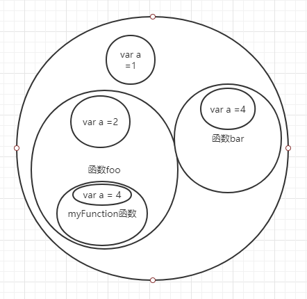
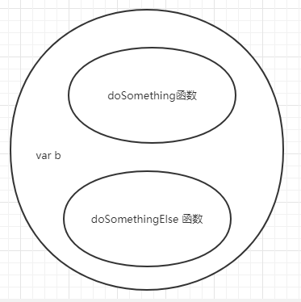

# 作用域


## 作用域是什么？

### 编译原理

​	程序中的一段源代码在执行之前会经历三个步骤，统称“编译”

- 分词/词法分析（Tokenizing/Lexing）
  - 例如将 `var a = 2;` 拆解成最基本的词法单元 `var` 、`a` 、`=` 、`2` 
-  解析/语法分析（Parsing）
  - 将词法单元流（数组）转换成一个由原生逐级嵌套所组成的代表了程序语法结构的数。这个树称为“抽象语法树”（AST，这个也是现代前端框架的关键所在）
- 代码生成
  - 将 AST 转换为可执行代码的过程被称为代码生成

简单来说：任何 JavaScript 代码片段在执行前都要进行编译（通常就在执行前）

### 理解作用域

变量的赋值操作会执行两个动作，首先编译器会在当前作用域中声明一个变量（如果之前没有声明过），然后在运行时引擎会在作用域中查找该变量，如果能够找到就会对它赋值

### 作用域嵌套

作用域是根据名称查找变量的一套规则

当一个块或函数嵌套在另一个块或函数中时，就发生了作用域的嵌套。因此，在当前作用域中无法找到某个变量时，引擎就会在外层嵌套的作用域中继续查找，直到找到该变量，或抵达最外层的作用域（也就是全局作用域）为止

我们通过一个例子来理解作用域

```javascript
var a = 1;
function foo() {
    var a = 2;
    console.log(a) 
    var myFunction =function() {
        var a = 3;
        console.log(a)
    }()
}
function bar() {
    var a = 4;
    foo()
}
bar() // 2 3
```

将函数翻译成图像如下：



每一个作用域就是一个域，在这个域中你的变量可以自定义，可以和外边的一样，也可以随便起，但代码执行时，先在执行域中找变量，找不到再往外面找，一层一层直到全局作用域。

注意哦，你代码写在哪里，你的作用域就定位在哪里，再例子中，foo函数和bar函数是同级（同一层面），他们内部的变量互不影响，这就是词法作用域

## 词法作用域和动态作用域

作用域共有两种主要的工作模式。第一种是最为普遍的，被大多数编程语言所采用的词法作用域，另一种叫做动态作用域，如 Bash脚本

词法作用域是一套引擎如何寻找变量以及会在何处找到变量的规则。词法作用域最重要的特征是它的**定义过程发生在代码的书写阶段**（假设你没有使用eval()或with），即你写好后你的作用域就定了

JavaScript 并不具有动态作用域。它只有词法作用域，简单明了，但是 this 机制某种程度上很像动态作用域

主要区别：词法作用域是在写代码或者说定义时确定的，而动态作用域是在运行时确定的（this 也是！）

**词法作用域关注函数在何处声明，而动态作用域关注函数从何处调用**

### 词法作用域

```javascript
function foo() {
    console.log(a)
}

function bar() {
    var a = 3;
    foo()
}

var a = 2;

bar() // a = 2
```

### 动态作用域（假设JavaScript中有动态作用域，实际上是没有的）

```javascript
function foo() {
    console.log(a)
}

function bar() {
    var a = 3;
    foo()
}

var a = 2;

bar() // a = 3
```

你可以形象的理解成，动态作用域是动的，我的 bar 在全局调用，bar 中又调用了 foo，调用 foo 打印console.log(a)，既然这样，就可以理解成这种思考模式：

```javascript
- function foo() {
-    console.log(a)
- }

function bar() {
    var a = 3;
    + function foo() {
    +    console.log(a)
	+ }
}
    
var a = 2;
    
bar()
```

将 foo 函数搬到 bar 函数中，那么我调用 bar 的时候，在 bar 函数中，a 自然就是 3 。这是一种区别于 词法作用域的一种思维模式，和 this 的情况是一样的（谁调用我，我就指向谁。很动态吧）

这也是JavaScript中让人着急的地方，一个语言中两种模式的存在，当你学会作用域后，以作用域的思考模式去理解 this 时，你常感到困惑，为什么 this 要指来指去，明明可以在子函数中写 this.name = name ，为什么还要先赋值给 that。现在看到动态作用域是不是解惑了一些，原来，**作用域是作用域，`this` 则以动态的形式存在于对象中的**

### 作用域的绝对领域

我写一个超级回调函数，等你看明白这个例子，你对作用域的理解就已登堂入室：

```javascript
var a = 1;
console.log(a)
var myFunction = function (){
    var a = 2;
    console.log(a)
    var myNextFuntion = function (){
        var a = 3;
        console.log(a)
        var myNextNextFunction = function() {
            var a = 4;
            console.log(a)
        }() 
    }()
}() // 立即执行函数

```

每一个函数中，必然有作用域，作用域就是领域，在我们领域中，打印出的a 就是我作用域中的a。作用域链就是如果我的作用域里没有，往我的上级找，知道找到这个变量（找不到就是 undefined）

另外一种角度：函数中的变量为私有变量，只有本函数才能访问。上级作用域不能访问下级作用域中的变量


## 作用域中的分类

在JavaScript 中，作用域是执行代码的上下文。作用域有四种类型：全局作用域、函数作用域（也称“局部作用域”）、块作用域和eval作用域

在函数内部使用var定义的代码，其作用域是局部的，且只对该函数的其他表达式是“可见的”，包括嵌套/子函数中的代码。在全局作用域内定义的变量从任何地方都可以访问，因为它是作用域链中的最高层/最后一个。

如下代码，因为作用域的影响，foo 的每个声明都是独一无二的

```javascript
var foo = 0; // 全局作用域
console.log(foo) // 0
var myFunction = function() {
    var foo = 1; // 函数作用域
    console.log(foo) // 1
    var myNestFunction = function() {
        var foo = 2 // 函数作用域
        console.log(foo) // 2
    }()
}()
eval('var foo = 3; console.log(foo);') // eval() 作用域
// 块作用域，锁住执行上下文
setTimeout(() => {
    for(var i = 0; i < 5; i++) {
        console.log(i)
    }
})

```

因为全局作用域和函数作用域已经是介绍作用域是什么的时候讲过，而且概念相对简单，我就不再赘述。eval() 函数会将传入的字符串当做 JavaScript 代码执行，也就是一句话一个作用域，很好理解，我也不再讲。让我们看看块级作用域

### 块级作用域

在ES6之前我们是没有块级作用域的，ES6中的 `let关键字` , `const关键字` 以及箭头函数都能锁住作用域。

我们先想一想没有块级作用域时会发生哪些问题：

```javascript
for(var i = 0; i < 5; i++) {
    setTimeout(function() {
        console.log(i)
    })
}
// 55555
```

我们希望它是怎么样的，在 for 循环中，每一个 i 都是独立的，即使是setTimeout 有延迟作用下，每个 i 都是进入事件循环队列中，然后一个一个打印出来

但是实际情况是，`var i = 0`  暴露在全局作用域中，因为setTimeout有滞后性（只要是setTimeout就把其中的函数塞入延迟消息队列中），所以先执行完 for 循环，for循环的结果是 1,2,3,4,5。但因为 i 是全局变量，所以 setTimeout 中的 `i`  统一为 5（每次i更新覆盖掉之前i值） 。怎么破？在ES6之前，将 for 循环中的函数改成立即执行函数（形成作用域），每次循环，IIFE就会生成一个新的作用域，使得延迟函数的调回可以将新的作用域封闭在每个循环内部，每个迭代中都会含有一个具有正确值的变量供我们访问

```javascript
for(var i = 0; i < 5; i++) {
    (function(j) {
		 setTimeout(function() {
        	console.log(j)
    	})
	})(i)
}
// 1 2 3 4 5
```

每传入一个 i 就执行函数，每一个 i 所处的 作用域都是独立的

后来有了 ES6 后，只需讲 var 改成 let 即可

```javascript
for(let i = 0; i < 5; i++) {
    setTimeout(function() {
        console.log(i)
    })
}
```

原因很简单，因为 let 自带 块级作用域，详细情况我将在 ES 系列中阐述，这里不做过多介绍。只需要知道有 let 和 const 的地方，它定义的变量 i 就被包裹在 块级作用域中（域有绝对领域，变量自成一方）

除了 let 和 const 外， ES6 中还有一个方法能做到块级作用域 —— 箭头函数

```javascript
for(let i = 0; i < 5; i++) {
    setTimeout(() => {
        console.log(i)
    })
}
```

箭头函数的神奇我也将在 ES6 系列中阐述，箭头函数的个人比较喜欢使用，它将 作用域 和 this 以 写法的形式统一了。因为我们知道 作用域是词法作用域，是静态的，你写在哪里，就定义了它的作用域所在，而 this 的指向是动态的，谁调用 this 指向谁。但是在箭头函数中，作用域和this指向它的父级。具体我会在ES6中——箭头函数篇章介绍

这样我们就又三种方法来解决for循环中setTimeout自变量改变的问题了。这里希望你能明白一个知识点。ES6之前JavaScript 是没有块级作用域概念的，只能通过立即执行函数来做出块级作用域的效果，而ES6之后，let，const，箭头函数形成了块级作用域联盟。块级作用域现在常被提起，也是因为这三位。

接下来我们来看看立即执行函数的意义

### IIFE(立即执行函数)

当我们开发一个网站时，往往会引入一些库，比如 jquery 等，当我们使用这些库时，假设这些库的写法都很乐色，没有隐藏其内部作用域，那么我们将面临 命名冲突。

为了解决这个问题，才有了模块化的概念，这个问题也在ES6中找到了答案，import export

在没有模块化之前，我们常用的方法是立即执行函数(IIFE)

```javascript
var a = 1;
(function(){
    var a = 2;
    console.log(a)  // 2
})()
(function(name) {
    console.log(name) // elaine
})('elaine')
;(function($){
    console.log($) // jquery
})(jquery)
```

每一个引用的库引入就执行，变量存在于所在作用域中，库于库之间相对分离，因为没有变量产生，也就没有污染全局的说法。

这么说，也许让你有点不太理解，我们从公式上理解它。

立即执行函数 = 匿名函数 + 立即执行

### 匿名函数

```javascript
var foo = function() {
    console.log('hello world')
}
foo()
setTimeout(function() {
    console.log('hello,setTimeout')
})
```

 之前在Function 篇章我们讲到过 匿名函数 的概念，不需要给这个函数标识符，因为它赋值给了foo，调用foo，就是执行函数

### 立即执行

```javascript
var sayHello = function () { console.log('hello,world') }() 
```

将这个函数赋值给sayHello后直接调用，立即执行它

### 立即执行函数

```javascript
(function (msg) {
    console.log(msg)
})('Hi')
```

匿名函数直接调用，这种写法能确保 匿名函数中的变量是独立的（因为函数作用域中的绝对领域，变量独立，不受外界变量印象）

记住，立即执行函数是函数，函数就有函数作用域，在作用域中变量各不影响

## 作用域陷阱

我们先来看一道题看看我们对

```javascript
function foo(x = 1, y = function() {x = 2}) {
    y();
    console.log(x)
}
foo()
```

<details>
    <summary>答案</summary>
    2
</details>

JavaScript 会将缺少 var 的变量声明（即使是在函数或者封装的函数中），声明在全局作用域中，而非局部作用域中。

因为 x = 1 没有声明x，所有 x 在 变量在全局作用域中，所有当执行 y 后 `x = 2`，改变的是全局变量中的 x，console.log(x) 自然就是 2 了

## 提升

本想在 作用域陷阱中一起讲完，但是这块知识过于重要，单独拿出来讲会比较好

我们之前理解的无论是函数作用域还是块作用域的行为是一样的：任何声明在某个作用域内的变量，都将附属于这个作用域。

### 先有鸡还是先有蛋

先来两个题目压压惊

```javascript
a = 2;

var a;

console.log(a)
```

<details>
    <summary>答案</summary>
    2
</details>

```javascript
console.log(a)
var a = 2;
```

<details>
    <summary>答案</summary>
    undefined
</details>

不知道你答对了没有

其实很简单，因为在 JavaScript 的执行之前要先被编译，编译器首先会找到所有的声明，并用合适的作用域将它们关联起来，再执行它。

所以即使你将 `var a` 写在 `a = 2` 后面，编译器也会将 `var a` 前置到最开头，这不是你我能控制，记住就是：先有蛋（声明）后有鸡（赋值）

同样的，函数的声明也会被提前，但是函数表达式不会被提升（只要记住就是，这是它的语言决定的）

## 函数优先

函数声明和变量都会被提升。但是 函数会首先被提升，然后才是变量

```javascript
foo(); // 1

var foo;

function foo() {
    console.log(1)
}

foo = function() {
    console.log(2) 
}
```

这段代码会被引擎理解为如下形式

```javascript
function foo() {
    console.log(1)
}

foo() // 1

foo = function() {
    console.log(2)
}
```

注意到没有，即使 `var foo` 写在 `function foo() {...}` 之前，但是函数声明会提升到变量之前，它是重复的声明（因此被忽略了）

总结：函数声明和变量声明都会提升到最顶部，而且函数声明会优于变量声明


## 隐藏内部实现

如下函数：

```javascript
function doSomething(a) {
    b = a + doSomethingElse(a * 2)
    console.log(b * 3)
}

function doSomethingElse(a) {
    return a - 1;
}
var b;

doSomething(2) // 15
```

你觉得这样的写法有问题吗？

虽然我们我可以这样写函数，但因为作用域的原因（词法作用域：定义在哪里，就在哪里形成作用域），隐形的在全局建造了 doSomethingElse 的作用域，也就是说 doSomethingElse 和 doSomething 是同等级的作用域



但示例中我们的函数我们想表达的是这个意思吗？

并不是，我们希望doSomethingElse 能在 doSomething 函数中，它的作用域在 doSomething 作用域中

```javascript
function doSomething(a) {
    function doSomethingElse(a) {
        return a - 1;
    }
    
    var b;
    
    b = a + doSomethingElse( a * 2 )
    
    console.log(b)
}

doSomething(2) // 15
```

在设计上将具体内容私有化， 无论是变量 b 还是函数 doSomethingElse 都属于 doSomething 的私有变量（或函数）。即全局作用域不能访问 doSomethingElse，只有在 doSomething 函数中才能调用 doSomethingElse


作用域与作用域链

作用域是集合

作用域链式是链表


## 总结

无论函数在哪里被调用，也无论它如何被调用，它的词法作用域都只由函数被声明时所处的位置决定

词法作用域意味着作用域是由书写代码时函数声明的位置来决定的。编译的词法分析阶段基本能够知道全部标识符在哪里以及是如何声明的，从而能够预测在执行过程中如何对它们进行查找。


变量提升，函数提升

后者覆盖前者，function的权重大于var

函数优先


词法作用域

简单地说，词法作用域就是定义在词法阶段的作用域。换句话说，词法作用域是由你在写代码时将变量和块作用域写在哪里来决定的，因此当词法分析器处理代码时会保持作用域不变（大部分情况下是这样的）。


作用域在函数定义的时候就决定了。函数会保存一个[[scope]]属性，它保存了所有的父作用域对象


这里需要注意的是每一个作用域都会进行提升操作