# 原型


> 原型让我想起了《百年孤独》，一族六代人的家族故事。我至今还记得书中的一句话：
> 家族的第一个人被绑在树上，家族的最后一个人正被蚂蚁吃掉。

我为什么会想到《百年孤独》，因为其 `__proto__`，prototype，constructor，以及函数与对象等，它们其中的关系一度让我找不到北，就好比《百年孤独》中的人物名，常常搞混。


### 先说结论:

原型(prototype)是给其他对象提供共享属性的对象。

所有 object 对象都有一个隐式引用

原型继承，就是指设置某个对象为另一个对象的原型

原型继承有两种形式，一种是显式原型继承，另一种是隐式原型继承。区别在于是否是开发者亲自操作

显式原型有两种方法，Object.setPropertyOf 和 Object.create，差别在于

1）前者需要两个对象，将 A 设置为 B 的原型。Object.setPropertyOf(A, B)

2）后者只需要一个对象，它将作为我创建的新对象的原型 const B = Object.create(A)。即以 A 为原型创建对象

class 的继承，继承的是行为和结构，但没有继承数据。

而基于 prototype 的继承，可以继承数据、结构和行为三者

`__proto__`  是对象所独有的，并且  `__proto__`  是**一个对象指向另一个对象**，也就是它的原型对象

`prototype`  是函数所独有的**。**它的作用就是包含可以给特定类型的所有实例提供共享的属性和方法。

**任何函数在创建时，都会默认给该函数添加  `prototype`  属性**

**constructor 属性也是对象所独有的，它是一个对象指向一个函数，这个函数就是该对象的构造函数。**

`__proto__` 和 constructor 是对象独有的。prototype 属性是函数独有的

在 JavaScript 中，函数也是对象，所以函数也拥有 `__proto__` 和 constructor 属性


### 前言：

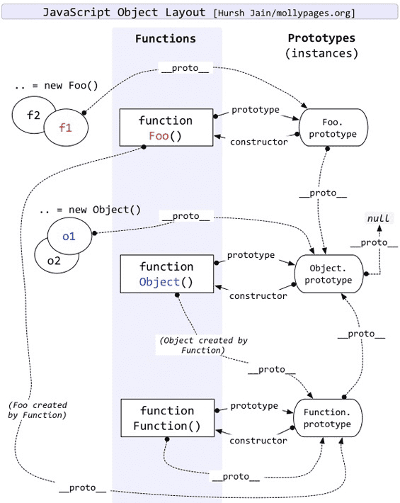

这是一张很有名的图，一般将原型和原型链的文章都会引用这张图进行分析，但本文想从另一个角度来解释，揭露 JS 原型背后的复杂背景。

### 1. 什么是原型

[ES2019](https://www.ecma-international.org/ecma-262/10.0) 是当前最新的语言规范，可以作为我们理解 JS 原型的权威素材来源。

我们先从规范开始，看看里面如何介绍 prototype

**1.1、prototype 的定义**

> 4.3.5 prototype
>
> object that provides shared properties for other objects

在规范里，prototype 被定义为：**给其他对象提供共享属性的对象**。

也就是说，prototype 自己也是对象，只是被用来承担某个职能罢了。

prototype 只是其中一种划分，我们也可以按照自己的需求，给出不同的划分和命名

比如实现 pubsub pattern 订阅/发布模式时，我们将某个对象称之为 subscriber 订阅者，另一个对象称之为 publisher 发布者。

构造函数的首字母为大写

都只是一个约定，约定俗成而已

同理，当某个对象，承担了**为其他对象提供共享属性**的职责时，它就成了该对象的 prototype。当它失去这个职能（比如子对象的原型被设置为其他对象），它就不叫该对象的 prototype。

换句话说，当我们说 prototype 对象时，是在做一个简略描述，实际上说的是“ XXX 对象的 prototype 对象”。如果不跟其他对象产生关联，就不构成 prototype 这个称谓。

因此，prototype 描述的是两个对象之间的某种关系（其中一个为另一个提供属性访问权限）。它是类型 father 父亲一样的称谓，而不是具有超能力的异常对象。

所有对象，都可以作为另一个对象的 prototype 来用。

##### 1.1.1、所有 object 对象都有一个隐式引用

> Every object has an implicit reference (called the object's prototype)

如上，规范中明确描述了所有对象，都有一个隐式引用，它被称之为这个对象的 prototype （原型）。

什么叫隐式引用？

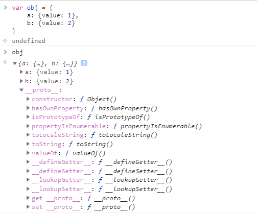

如上图所示，在我们编写的代码里，只声明了 obj 对象的 a 和 b 两个属性。

在控制台却可以发现它有 `__proto__` 属性，这意味着 obj 被隐式地挂载了另一个对象的引用，置于 `__proto__` 属性中。

也就是说，所谓的隐式，是指不是由开发者亲自创建/操作。

##### 1.1.2、历史问题：`__proto__`

前面措词里“隐式地挂载引用”，这跟规范里描述的“隐式引用”，有一定的差别。

它们是两个维度。

一个是在操作层面上的隐式：是否偷偷做了挂载属性的动作。

一个是在关系层面上的隐式：这个属性能不能被直接访问。

`__proto__` 的例子，说起来比较复杂，可以说是一个历史问题。

ECMAScript 规范描述 prototype 是一个隐式引用，但之前的一些浏览器，已经私自实现了 `__proto__` 这个属性，使得可以通过 `obj.__proto__` 这个显式的属性访问，访问到被定义为隐式属性的 prototype。

因此，情况是这样的，ECMAScript 规范说 prototype 应当是一个隐式引用:

1）通过 Object.getPrototypeOf(obj) 间接访问指定对象的 prototype 对象。

2）通过 Object.setPrototypeOf(obj, anotherObj) 间接设置指定对象的 prototype 对象。

3）部分浏览器提前开了 `__proto__` 的口子，使得可以通过 `obj.__proto__` 直接访问原型，通过 `obj.__proto__ = anotherObj` 直接设置原型。

4）ECMAScript 2015 规范只好向事实低头，将 `__proto__` 属性纳入了规范的一部分。

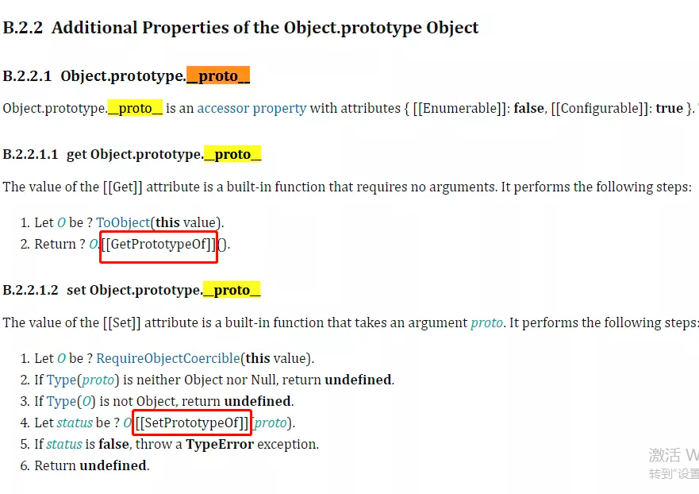

在 Object.prototype 上有 `__proto__` 属性，不过在你 chrome 中看到的 `__proto__` 属性则是开发者工具为了方便开发者查看原型，故意渲染出来的虚拟节点。虽然与对象的其它属性并列，但并不在改对象中（如下图）

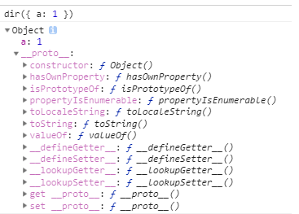

`__proto__` 属性既不能被 for in 比那里出来，也不能被 Object.keys(obj) 查找出来

访问对象的 `obj.__proto__` 属性，默认走的是 Object.prototype 对象上的 `__proto__` 属性的 get/set 方法。

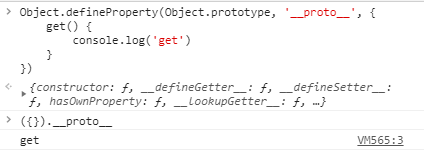

通过覆盖 `Object.prototype.__proto__` 我们可以看到，访问普通对象的 `__proto__` 触发了 Object.prototype 上的 `__proto__` 的 get 方法

**1.2、对象的创建和关联原型**

许多介绍 JS 原型的文章，都从 constructor 构造函数和 prototype 入手。本文并没有这样做。

因为 prototype 的概念，跟对象的构造方式和原型关联方式，其实是两个问题。

JavaScript 只是其中一个 prototype-based inheritance 的语言，其它同样包含 prototype 概念的语言，并不像 JS 那样通过 constructor 和 prototype 构造对象和关联其原型。

因此，当我们谈论 prototype 时，它可以跟 constructor 和 constructor.prototype 无关。

**1.2.1、两类原型继承方式**

所谓的原型继承，就是指设置某个对象为另一个对象的原型（塞进该对象的隐式引用位置）。

在 JavaScript 中，有两类原型继承的方式：**显式继承**和**隐式继承**。

**1.2.1.1、显式原型继承**

在前文我们曾描述过显式跟隐式的差别：**是否由开发者亲自操作**

所谓的显式原型继承，就是指我们亲自将某个对象设置为另一个对象的原型。

```javascript
const obj_a = { a: 1 };
const obj_b = { b: 1 };
Object.setPrototypeOf(obj_b, obj_a);
console.log(obj_b);
```

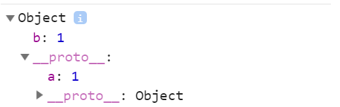

如上，通过调用 Object.setPrototypeOf 方法，我们将 obj_a 设置为 obj_b 的原型。访问 `obj_b.a` 时，lookupProperty （查找属性）过程，先检查 obj_b 是否有 a 属性，没有就检查其原型 obj_a，可以找到 `obj_a.a` 最后返回 1。

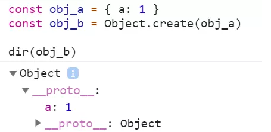

除了 Object.setPrototypeOf 方法以外，还有另一种途径。即是通过 Object.create 方法，直接继承另一个对象。

Object.setPropertyOf 和 Object.create 的差别在于：

1）Object.setPropertyOf ，给我两个对象，我把其中一个设置为另一个原型（后者为前者的原型）

2）Object.create，给我一个对象，它将作为我创建的新对象的原型。

当我们已经拥有两个对象时，要构建原型关联，可以通过 Object.setPrototypeOf 来绑定

当我们只有一个对象，想以它为原型，创建新对象，则可通过 Object.create 来处理

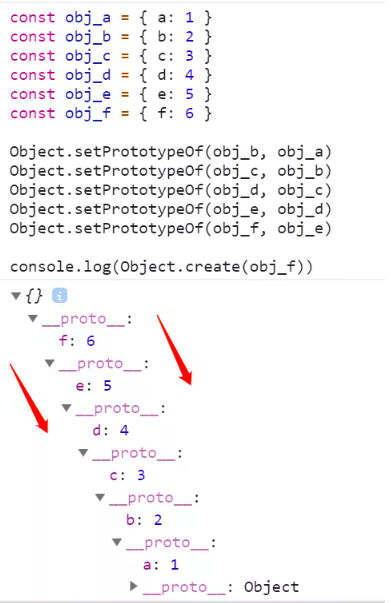

如上图所示，我们先创建好 6 个对象 a, b, c, d, e 和 f，然后用 Object.setPrototypeOf 将它们依次关联起来，最后用 Object.create 基于 f 创建新对象。

从控制台可以看到，第一层是一个空对象，第二层则是 f，f 的原型是 e，e 的原型是 d，依次类推，最后兜底的原型是 Object.prototype。

**1.2.1.2 隐式原型继承**

JavaScript 提供了隐式的原型继承方式，在讨论它之前，我们先把事情描述的更细致一些。

想要得到一个包含了数据、方法以及关联原型三个组成部分的丰满对象，一个相对具体的步骤如下：

1）创建空对象

2）设置该空对象的原型为另一个对象或者 null

3）填充该对象，增加属性或方法。

假设没有隐式原型继承，创建一个普通的 js 对象，要向下面这样：

```javascript
// create
const obj = {}

// linking
Object.setPrototypeOf(obj, Object.prototype)

// initialize
obj.firstname = 'Johnny'
obj.lastname = 'joestar'
```

这样太繁琐，要让用户无感知的完成**创建对象**、**原型继承**和**属性初始化**的过程

我们设计一个方案：

1）我们将某些函数称之为 constructor，专门用来做属性初始化

```javascript
function User(firstname, lastname) {
    this.firstname = firstname;
    this.lastname = lastname
}
```

2)  我们约定，constructor 函数，有一个特殊属性 prototype

```javascript
User.prototype = Object.create(Object.prototype)
```

3)  让用户使用 new 关键字，去创建新对象

```javascript
const user = new User('johnny', 'joestar')
```

4) 在内部，我们偷偷做创建对象，关联原型和属性初始化等一些列过程

```javascript
function User(firstname, lastname) {
    this.firstname = firstname;
    this.lastname = lastname;
}
User.prototype = Object.create(Object.prototype)
const user = new User('johnny', 'joestar')
console.log('user', user)
```

用户能拿到跟自己手动创建一样的结果，但从3件事情，减少到了2件。他们不用亲自创建空对象了。

那可不可以事先主用户最好只做一件事情。

让所有函数，都有 prototype 属性，它默认是以 Object.prototype 为原型的对象。

这样用户通常只需要编写 constructor 函数，描述如何初始化对象的属性即可。除非他们需要新增方法，否则都不必操作 constructor 的 prototype 对象

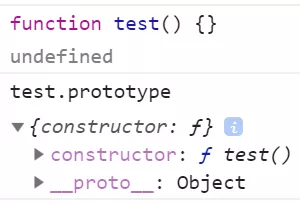

如上，普通函数创建时，自带了 prototype 属性，该函数是一个对象，包含 constructor 字段，指向构造函数

```javascript
function User(firstname, lastname) {
  this.firstname = firstname;
  this.lastname = lastname;
}
const user = new User("johnny", "joestar");
user.constructor === User; // true
```

我们的 User 定义，简化为一个 User 函数，通过 new 去创建 user 对象，可以通过 user.constructor 访问到它的构造函数。

**1.2.2 内置的构造函数和语法糖**

JavaScript 的主流继承方式，选择了隐式原型继承，它提供了几个内置的 constructor 函数，如 Object, Array, Boolean, String, Number 等。

当我们使用对象字面量创建一个新对象时，它有两层隐式行为。

1）隐式的通过 new Object() 去创建对象

2）隐式的进行原型继承

一个简单的语句，也包含了许多复杂的过程。

不仅如此，在名称的选择上，也没有特意去规避误解。

constructor 是一个函数，而所有函数都是 new Function 创建出来的，函数字面量可以看作是它的语法糖。

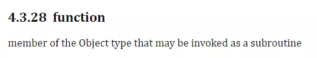

Function 在 ECMAScript 规范里，被定义为对象的一种。

也就是说，函数也是对象，也有自己的隐式引用（原型）。但函数的 prototype 属性，却不是该函数对象的原型。

而是基于前面介绍的隐式原型继承规则，作为原型，挂载到 new F() 创建出来的新对象内部


我想任何刚接触的，心智正常的开发者，在控制台看到函数的 prototype 和 `__proto__` 两个属性，都会感到困惑吧。

可以说，JS 原型之所以难以理解，主要原因是设计上的问题，而非技术难度。

如果将 constructor 函数的 prototype 改名为 properties。问题可能少很多。或者进一步简写成 props，理解上将更加简单。不就是 new Constructor 时，自带了它的 Constructor.props 对象嘛

也就是说你构造函数里的属性和动作会在 new 时，带到实例对象中

```javascript
function User(firstname, lastname) {
  this.firstname = firstname;
  this.lastname = lastname;

  this.callMyName = function () {
    console.log("my name is" + this.firstname + this.lastname);
  };
}
const user1 = new User("johnny", "joestar");
const user2 = new User("elaine", "joestar");
console.log(user1);
console.log(user2);
```

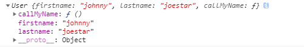

我们在构造函数中定义的属性 `this.firstname`，`this.lastname` 以及 动作 `this.callMyName` 。在 new User 时，继承了 User（构造函数）中的所有 prototype（即前面说的 `User.props`）对象


#### **2、隐式原型继承和显式原型继承的互操作性**

不管是隐式原型继承，还是显示原型继承，只是外在形态，核心是具有设置对象的隐式引用的功能。它们之间具备一定互操作性，也就是说，拥有其中一个，可以实现另一个的部分行为。

**2.1、从隐式原型继承中剥离出 Object.create 方法**

如前所述，隐式原型继承，是将 create，linking，initilize (初始化) 等多个步骤耦合到一起。我们可以做一解耦动作

```javascript
const create = (proto) => {
  let Noop = function () {};
  Noop.prototype = proto;
  return new Noop();
};
```

如上，我们实现了一个简单的 Object.create 方法，它可以根据给定对象，创建以该对象为原型的新对象（Object.create 有第二个参数，按下不表）

做法很简单，将 constructor 设置为空函数（let Noop = function() {}）,相当于没有了属性初始化的过程，将 Noop 的原型绑定赋值给传来的 proto（关联原型），最后返回基于空函数的实例化对象（return new Noop）

有趣的是，在 ES5 之前， JS 里只有隐式原型继承。大家都是利用类似上面的解耦做法，去得到一个可以显示原型继承的函数

即 Object.create 和 Object.setPropertyOf 还没有之前

##### 2.2、用显式原型继承的方式完成 constructor 初始化过程

显式原型继承，是指使用 Object.setPrototypeOf 或 Object.create 方法，手动设置原型。它比隐式原型继承，更细粒度

我们可以通过更细粒度的特性，去实现 new 语句所做的内容（手写 new ）

```javascript
const createInstance = (Constructor, ...args) => {
    // 创建一个基于 Constructor 的原型的实例
    let instance = Object.create(Constructor.prototype);
    // 通过 call 将 Constructor 种的 this 指向 instance
    Constructor.call(instance, ...args);
    // 返回实例
    return instance
}
```

如上，实现一个 createInstance 创建实例对象的普通函数，它接受一个 Constructor 构造函数参数和 args 参数。

按照隐式原型继承中描述的步骤，先将 Constructor.prototype 作为原型，创建一个空对象，然后通过 Constructor.call 将构造函数内部的 this 指向 instance 变量，将 args 传入。在构造函数内部完成属性初始化的过程。

```javascript
const createInstance = (Constructor, ...args) => {
  let instance = Object.create(Constructor.prototype);
  Constructor.call(instance, ...args);
  return instance;
};
function User(firstname, lastname) {
  this.firstname = firstname;
  this.lastname = lastname;
}
const user = createInstance(User, "Jade", "Gu");
console.log("user", user);
```

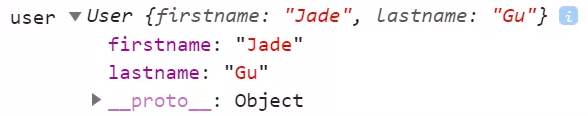

使用 createInstance 创建 user 对象，跟 new User 得到的结果一样

**3.2、从 class 角度理解 prototype**

class 的职责是充当创建 object 的模板，通常来说，data 数据是由 instance 承载，而 methods 行为/方式则在 class 里。

也就是说，基于 class 的继承，继承的是行为和结构，但没有继承数据。

而基于 prototype 的继承，可以继承数据、结构和行为三者。

这是因为， prototype 无非是另一个对象，它跟其他对象一样，拥有自己的非函数属性（数据）和函数属性（方法）。

作为对象的 prototype，不仅可以被继承，还能被当作值来传递，它跟其他普通对象，并没有区别。

1）class —> class 之间存在继承关系，object 基于某个已完成继承关系的 class 模板所创建

2）object —> object 之间存在继承关系，object 可以由各种方式创建。可以在创建时设置继承对象，也可以在创建后修改继承对象。

基于上述差异，有些开发者认为 prototype-based 的模式，比 class-based 的模式，更加面向对象。他们表示：难以想象还有比直接继承另一个已存在的对象，更加面向对象了。

```javascript
class Test {
  a = 1;
  constructor() {
    this.b = 1;
  }
  show() {
    return a + b;
  }
}
const test = new Test();
```

在 JS 里的，class 是用 prototype 所模拟的，**为了迎合 class 的基本行为， prototype 继承数据的能力被屏蔽了**

如上图所示，不管我们通过 class fields （类中变量，不知道正不正确）语法，还是在 constructor 里面声明数据。最后，它们都会出现在实例对象上，而非原型对象上。

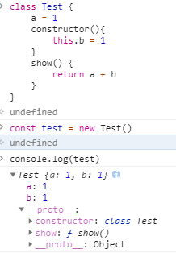

只有 methods 方法的部分，出现在该 class 对应的原型上。

如按照我们设想的，将 a 放在 原型上是非常方便的，

```javascript
function TestPrototype() {
  this.b = 1;
}
TestPrototype.prototype.show = function () {
  return a + b;
};
TestPrototype.prototype.a = 1;
const test1 = new TestPrototype();
```

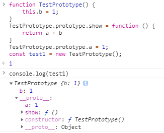

或许我们这样写，更加面向对象

```javascript
function TestPrototype2() {
  this.b = 1;
}
TestPrototype2.prototype = {
  a: 1,
  show: function () {
    return a + b;
  },
};
const test2 = new TestPrototype2(); // 效果同上
```

如果我们想到的 prototype-based 继承数据的能力，需要自己手动 constructor 的 prototype 对象，挂载数据上去。不过此时，它已经超出了 class 的默认行为，进入原型继承的领域


### 总结

总体上，是从工业聚大大那边抄来的，不过在抄的过程中，自己手打了一边，理解程度更深了一层。

原来原型（prototype）就是一个对象，在函数创建的时候就自带了。我们按照约定俗称，将首字母大写的函数视为构造函数（constructor）


任何函数在创建时，都会默认给该函数添加  `prototype`  属性


`__proto__` 和 `constructor` 是对象独有的。 `prototype` 属性是函数独有的。

但是在 JavaScript 种，函数也是对象，所以函数也拥有 `__proto__` 和 `constructor` 属性

 在函数创建的时候


参考资料：

[深入理解 JavaScript 原型](https://mp.weixin.qq.com/s/1UDILezroK5wrcK-Z5bHOg)