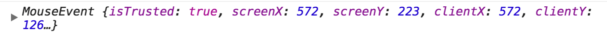

# 防抖（debounce）

怎么理解防抖


在前端代码中，我们常会遇到一些场景，滚动屏幕，上拉加载图片，搜索关键字，如果前端不做处理，把请求都交给后端，后端的压力就会非常大，这样导致用户体验也会受到一些影响，所以在日常开发中，我们会对其进行防抖和节流的操作。

本节我们来讲讲防抖


### 原理

防抖的原理是：不管事件触发频率有多高，一定在事件触发 `n` 秒后才执行。如果你在事件触发的 `n` 秒内又触发了这个事件，那就以新事件的时间为准，`n` 秒后才执行。总之，要等你触发完事件 `n` 秒内不再触发事件，我才执行

根据这段表述，我们可以写第一版的代码：

```javascript
function debounce(func, wait) {
    var timeout;
    return function () {
        clearTimeout(timeout)
        timeout = setTimeout(func, wait)
    }
}
```

### this

如果我们在  `getUserAction` 函数中`console.log(this)` , 在不使用 `debounce` 函数的时候， `this` 的值为：

```htnl
<div id="container"></div>
```

但是如果使用我们的 debounce 函数，this 就会指向 Window 对象

所以我们要改变 this 的指向，让它指向它该指向的地方

```javascript
// 第二版
function debounce(func, wait) {
    var timeout;
    
    return function() {
        var self = this;
        
        clearTimeout(timeout)
        setTimeout(function() {
        	func.apply(self) // 使用 func,bind(self) 一样的效果
        }, wait)
    }
}
```

现在 this 已经可以正确指向了。让我们看下个问题

### event问题

JavaScript 在事件处理函数中会提供事件对象 event，我们修改下 getUserAction 函数：

```javascript
function getUserAction(e) {
    console.log(e)
    container.innerHTML = count++
}
```

如果我们不适用 debounce 函数，这里会打印 MouseEvent 对象



但是在我们实现的 debounce 函数中，却只会打印 undefined！

所以我们需要修改一下代码，将参数赋值上去

```javascript
.// 第三版
function debounce(func, wait) {
    var timeout;
    
    return function () {
        var self = this;
        var args = arguments;
        
        clearTimeout(timeout)
        timeout = setTimeout(function() {
            func.apply(self, args)
        }, wait)
    }
}
```

到此为止，我们修复了两个小问题：

- this 指向
- event 对象

其实到这里，就已经实现了防抖的“面试”代码，但我们的可以再次基础上再完善一番

### 立即执行

需求：我不希望非要等到事件停止出发后才执行，我希望立即执行函数，然后等到停止触发 n 秒后，才可以重新触发执行

那么我们加个 immediate 参数判断是否是立刻执行

```javascript
// 第四版
function debounce(func, wait, immediate) {
    var timeout;
    
    return function () {
        var self = this;
        var args = arguments;
        
        if (timeout) clearTimeout(timeout)
        if (immediate) {
            // 如果已经执行过，不再执行
            var callNow = !timeout;
            timeout = setTimeout(function () {
                timeout = null
            }, wait)
        } else {
            setTimeout(function() {
                func.apply(self, args)
            }, wait)
        }
    }
}
```


### 返回值

此时注意一点，getUserAction 函数可能是有返回值的，所以我们也要返回函数的执行结果，


无论是防抖，还是节流，都是闭包的引用

防抖和节流都是防止某一时间频繁触发，但是原理不一样

防抖是某一段时间内只执行一次，而节流是间隔时间执行


引用场景：

debounce 

- search搜索联想，用户在不断输入值时，用防抖来节约请求资源。
- window触发resize的时候，不断的调整浏览器窗口大小会不断的触发这个事件，用防抖来让其只触发一次

throttle 

- 鼠标不断点击触发，mousedown(单位时间内只触发一次)
- 监听滚动事件，比如是否滑到底部自动加载更多，用throttle来判断


老外写的防抖与节流

https://css-tricks.com/debouncing-throttling-explained-examples/


### 如何区分节流和防抖

防抖是虽然事件持续触发，但只有等事件停止触发后 n 秒才执行函数，节流是持续触发的时候，每 n 秒执行一次函数


### 参考资料

[JavaScript专题之跟着underscore学防抖](https://github.com/mqyqingfeng/Blog/issues/22)