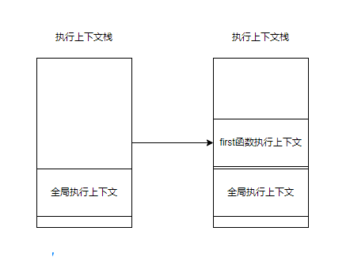

# 执行上下文与执行上下文栈


写在前面，我们需要前置知识，先了解下什么是执行上下文栈，

以及每个执行上下文，都有三个重要属性：

- 变量对象（Variable object，VO）
- 作用域链（Scope chain）
- this


执行上下文，有栈的概念，先把全局的压进去，看到有函数要执行，再塞进去，

栈的特点：先进后出

有没有koa的洋葱模型既视感

https://juejin.im/post/6844903473301946381


```javascript
var scope = "global scope";
function checkscope(){
    var scope = "local scope";
    function f(){
        return scope;
    }
    return f();
}
checkscope();

```


```javascript
var scope = "global scope";
function checkscope(){
    var scope = "local scope";
    function f(){
        return scope;
    }
    return f;
}
checkscope()();

```


```
checkscope()
```


执行上下文的代码会分成两个阶段进行处理：分析和执行，我们也可以叫做：

1. 进入执行上下文
2. 代码执行


当全局代码执行时，它将在全局执行上下文执行，而函数代码执行函数执行上下文中执行


每次只能有一个执行上下文处于运行状态，因为 JavaScript 是单线程语言，它由执行栈或（叫）调用栈来管理


执行堆栈是具有 LIFO（后进先出）结构的堆栈，只能从堆栈顶部添加或删除项目


当执行完毕后，其执行上下文从堆栈中弹出，并且指针将指向堆栈中位于其下方的执行上下文

```javascript
let a = 'Hello World!'

function first() {
    console.log('函数执行上下文')
}

first()

console.log('全局执行上下文')
```

当执行此代码时， JavaScript 引擎会创建一个全局执行上下文来执行该全局代码，并且当它遇到 `first()` 函数调用时，它将为函数创建一个新的执行上下文将其推入执行堆栈的顶部。



当`first()` 函数结束，它的执行堆栈被从栈中删除，并且指针达到到其下方的执行上下文，即全局执行上下文


https://gitbook.cn/gitchat/column/5c91c813968b1d64b1e08fde/topic/5c99a9a3ccb24267c1d01960

执行上下文就是当前代码的执行环境/作用域，和前文介绍的作用域链相辅相成，但又是完全不同的两个概念。直观上看，执行上下文包含了作用域链，同时它们又像是一条河的上下游：有了作用域链，才有了执行上下文的一部分。


执行阶段主要任务是执行代码，执行上下文在这个阶段全部创建完成。


javascript 代码在预编译阶段对变量的内存进行分配，我们熟悉的变量提升过程是在此阶段完成的。

经过预编译过程，我们应该注意四点：

- 预编译阶段进行变量声明
- 预编译阶段变量声明进行提升，但是值为 undefined
- 预编译阶段所有非表达式的函数声明进行提升
- 函数声明的优先级大于变量声明


作用域在预编译阶段确定，但是作用域链是在执行上下文的创建阶段完成生成的。因为函数在调用时，才会开始创建对应的执行上下文。执行上下文包括了：变量对象、作用域链以及 `this` 的指向


在调用函数时，javascript引擎会遍历该函数，并为这个函数创建一个执行上下文，最后将该函数的执行上下文压入栈中


### 如何追踪执行上下文栈

`console.track()` 

如何在chrome中查看执行上下文的使用

极客时间的文章


### 执行上下文中有什么？

执行上下文包括：变量环境、词法环境、outer、this。

也就是说，this 是和执行上下文绑定的，即 **每个执行上下文都有一个this**


### 执行上下文有几种？

分三种

- 全局执行上下文

- 函数执行上下文

- eval执行上下文


this也只有三种

- 全局执行上下文中的this

- 函数中的this

- eval中的this


#### 全局执行上下文中的 this 

在浏览器中，全局执行上下文中的 this 指向 window 对象

在Node中，this 则指向 Globle 对象


#### 函数执行上下文中的 this


创建执行上下文有两个阶段

- 创建阶段
- 执行阶段


#### 创建阶段

在 JavaScript 代码执行前，执行上下文将经历创建阶段。在创建阶段会发生三件事：

1. this 值的决定，即我们所熟知的 this 绑定
2. 创建词法环境
3. 创建变量环境


所以执行上下文在概念上表示如下：

```javascript
ExecutionContext = {
    thisBinding = <this value>,
    LexicalEnvironment = { ... },
    VariableEnvironment = { ... },
}
```


词法环境

变量环境


词法环境的内部有两部分组成：环境记录器、外部环境的引用

1. 环境记录器是存储变量和函数声明
2. 外部环境的引用意味着它可以访问其父级词法环境（作用域）


变量环境：

它同样是一个词法环境

在ES6中，**词法环境** 和 **变量环境** 的一个不同就是前者被用来存储函数声明和变量（`let` 和 `const`）绑定，而厚泽只用来存储 `var` 变量绑定


winter

> 针对执行上下文的概念：
>
> **执行上下文在ES3中**，包含三个部分。
>
> - scope：作用域，也常常被叫做作用域链
> - variable object：变量对象，用来存储变量的对象
> - this value：this 值
>
> **在ES5中**，我们改进了命名方式，把执行上下文最初的三个部分改成下面这个样子
>
> - lexical environment：词法环境，当获取变量时使用
> - vriable environment：变量环境，当声明变量时使用
> - this value：this值
>
> 在


活动对象（activation object，AO）来表示变量对象

被激活的变量对象叫做活动对象，


