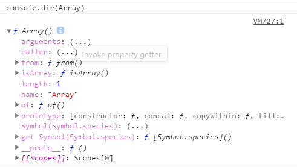
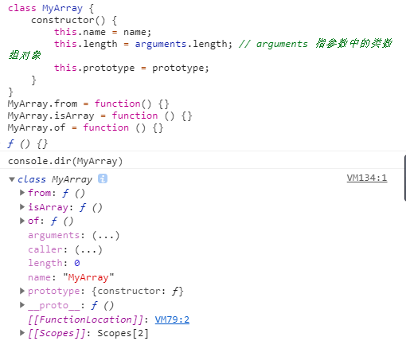

# 数组
## 概要

数组是一组按序排列的值，创建数组的目的通常是遍历数字索引值，以零索引开始。

我们需要了解的是，数组是按照数字顺序排列的集合，相对地，对象的属性名称是无序的。

从本质上讲，数组使用数字作为查找建，而对象拥有用户自定义的属性名。

 JavaScript 没有真正的关联数组，对象可用于实现关联数组的功能


如果我们想了解数组中有什么方法和属性，有个很简单的方法——通过浏览器打印 Array

```javascript
console.dir(Array)
```



除去 arguments、caller、Symbol、get Symbol 以及 [[Scopes]] （这些是什么？具体我还没搞明白，不过本文重点在于分析Array的构造函数的属性和方法以及它原型上的属性和方法）

我们可以得出，Array 的属性有 length，name，prototype（所有的函数创建时，都会默认给该函数添加 `prototype` 属性[见原型篇章]）

方法有：from()、isArray()、of()

写个Class模拟Array就是：

```javascript
class MyArray {
    constructor() {
        this.name = name;
        this.length = arguments.length; // arguments 指参数中的类数组对象
        this.prototype = prototype;
    }
}
MyArray.from = function() {}
MyArray.isArray = function () {}
MyArray.of = function () {}
```



ps： 这里提一句，用class模拟类(继承)，它的constructor函数 其实也很好记，它就是用来做属性初始化的，它很特殊，写在class中，但不在prototype里


## Array() 原型上的属性和方法


## Array() 属性和方法

Array() 对象具有以下属性（不包括继承的属性和方法）

**属性**

- prototype


## 3. 数组对象实例属性和方法

**实例属性**

- constructor

- index

- length

  - ```javascript
    var myArray = ['foo', 'bar'];
    myArray.length
    ```


**实例方法**

- pop()

  - `pop()` 方法从数组中删除最后一个元素，并返回该原生的值。该方法更改数组的长度

  - ```javascript
    const plants = ['broccoli', 'cauliflower', 'cabbage', 'kale', 'tomato'];
    console.log(plants.pop()) // 移出 tomato
    console.log(plants) // ['broccoli', 'cauliflower', 'cabbage', 'kale']
    ```

- push()

  - `push()` 方法将一个或多个元素添加到数组的末尾，并返回该数组的新长度

  - ```javascript
    const animals = ['pigs', 'goats', 'sheep'];
    const count = animals.push('cows');
    console.log(count) // 4
    console.log(animals) // ["pigs", "goats", "sheep", "cows"]
    ```

- reverse()

  - `reverse()` 方法将数组中原生的位置颠倒，并返回该数组。数组的第一个元素变成最后一个，数组的最后一个元素变成第一个。该方法会改变原数组

  - ```javascript
    const array1 = ['one', 'two', 'three'];
    console.log('array1', array1); // ["one", "two", "three"]
    const reversed = array1.reverse() 
    console.log('reversed', reversed) // ['three', 'two', 'one']
    console.log('array1': array1) // ['three', 'two', 'one'] 改变原数组
    ```

    所以一般如果你要颠倒一个数组时，先深拷贝先

- shift()

  - `shift()` 方法从数组中删除**第一个**元素，并返回该元素的值。此方法更改数组的长度

  - ```javascript
    const array1 = [1, 2, 3];
    const firstElement = array1.shift();
    console.log(array1); // [2, 3]
    console.log(firstElement) // 1
    ```

- sort()

  - `sort()` 方法用原地算法对数组的元素进行排序，并返回数组。默认排序是在将元素转换为字符串，然后比较他们的UTF-16代码单元制序列时构建

  - 由于它取决于具体实现，因此无法保证排序的时间和空间复杂性

  - ```javascript
    const months = ['March', 'Jan', 'Feb', 'Dec'];
    months.sort();
    console.log(months) // ["Dec", "Feb", "Jan", "March"]
    const array1 = [1, 30, 4, 21, 1000];
    array1.sort();
    console.log(array1) // [1, 100000, 21, 30, 4]
    ```

- splice()

  - `splice()` 方法通过删除或代替现有元素或者原地添加新的元素来修改数组，并以数组形式返回被修改的内容。此方法会改变原数组

  - ```javascript
    const months = ['Jan', 'March', 'April', 'June'];
    months.splice(1, 0, 'Feb'); // 从第 1 位开始删除0个元素，插入'Feb’
    console.log(months); // ['Jan', 'Feb', 'March', 'April', 'June']
    months.splice(4, 1, 'May'); // 从第 4 位开始删除1个元素，并插入'May'
    console.log(months) // ["Jan", "Feb", "March", "April", "May"]
    ```

  - 第一个参数，指定修改的开始位置（从0计数）

- unshift()

  - `unshift()` 方法将一个或多个元素添加到数组的**开头**，并返回该数组的**新长度**（该方法修改原数组）

  - ```javascript
    const array1 = [1, 2, 3];
    console.log(array1.unshift(4, 5)); // 5
    console.log(array1) // [4, 5, 1, 2, 3]
    ```

- concat()

  - `concat()` 方法用于合并或多个数组。此方法不会更改现有数组，**而是返回一个新数组**

  - ```javascript
    const array1 = ['a', 'b', 'c'];
    const array2 = ['d', 'e', 'f'];
    const array3 = array1.concat(array2);
    console.log(array3) // ["a", "b", "c", "d", "e", "f"]
    console.log(array1) // ['a', 'b', 'c'];
    ```

- join()

  - `join()` 方法将一个数组（或一个类数组对象）的所有元素连接成一个字符串并返回这个字符串。如果数组只有一个项目，那么将返回该项目而不适用分隔符

  - ```javascript
    const elements = ['Fire', 'Air', 'Water'];
    console.log(elements.join()) // "Fire,Air,Water"
    console.log(elements.join('')) // "FireAirWater"
    console.log(elements.join('-')) // "Fire-Air-Water"
    ```

- slice()

  - `slice()` 方法返回一个新的数组对象，这一对象是一个由 `begin` 和 `end` 决定的原数组的**浅拷贝**（包括`begin`，不包括`end`）。原始数组不会被改变

  - ```javascript
    const animals = ['ant', 'bison', 'camel', 'duck', 'elephant'];
    
    console.log(animals.slice(2)) // ["camel", "duck", "elephant"]
    console.log(animals.slice(2, 4)) // ["camel", "duck"]
    console.log(animals.slice(1, 5)) // ["bison", "camel", "duck", "elephant"]
    ```

- of()

- isArray()

- from()

- forEach()

- filter()

- find()

- reduce()

- some()


## 4.数组方法备忘录

- ### 添加/删除元素

  - push(...items) —— 从结尾添加元素

  - pop() —— 从截取提取元素

  - shift() —— 从开头提取元素

  - unshift(...items) —— 从开头添加元素

  - splice(index, deleteCount, ...items) —— 从 `index` 开始： 删除 `deleteCount` 元素并在当前位置插入元素

  - slice(start, end) —— 它从所有元素的开始索引`“start”` 复制到 `end` （不包括（`end`））返回一个新的数组

  - concat(...items) —— 返回一个新数组：复制当前数组的所有成员并向其中添加 `items`。如果有任何`items` 是个数组，那么就取其元素 


https://juejin.cn/post/6907109642917117965


