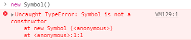

# 原型与原型链


一般讲原型概念时，我们常将构造函数与原型放在一起讲。在将原型章节时，我们只讲原型，并没深入讲解构造函数与原型的关联。

可JS毕竟是 constructor与 prototype 相关联的。本章就讲讲构造函数与原型


原生数据类型我们通常想到6种：`undefined`、`null` 、`boolean` 、`string` 、 `number` 、`object`

`symbol` 是 ES6 新增的一个原生数据类型

Symbol本身有是一个方法

```javascript
typeof Symbol() // symbol
```

但 Symbol不能作为构造函数使用

```javascript
new Symbol()
// 报错
```




ES6 中的 Symbol 不是个构造函数