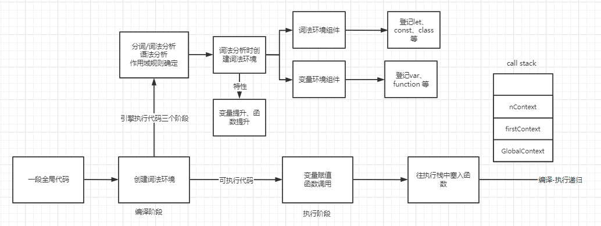

# 词法环境（Lexical Environment）


### 前言

在说一个概念前，我们需要确定它的前提，此文以ECMAScript5为基础撰写


### 一句话解释

词法环境就是在 JavaScript 代码执行时记录变量声明、函数声明、函数声明的形参的合集


### JavaScript 的编译过程

在介绍 `词法环境` 前，我们先看下在 V8 里 JavaScript 的编译执行过程，大致分为三个阶段

第一步：V8 引擎刚拿到 `执行上下文` 的时候，会把代码从上到下一行一行的先做分词/词法分析(Tokenizing/Lexing)。分词是指：比如 `var a = 2;` 这段代码，会被分词为：`var` `a` `2`和`;`这样的原子符号(atomic token)；词法分析是指：登记变量声明、函数声明、函数声明的形参

第二步：在分词结束以后，会做代码解析，引擎将 token 解析翻译成一个AST(抽象语法树)， 在这一步的时候，如果发现语法错误，就会直接报错不会再往下执行

第三步：引擎生成CPU可以执行的机器码

在第一步里有个词法分析，它用来登记变量声明、函数声明、函数声明的形参，后续代码执行的时候就知道去哪里拿变量的值和函数了，这个登记的地方就是`Lexical Environment(词法环境)` (抄自[深入理解JavaScript-词法环境](https://limeii.github.io/2019/05/js-lexical-environment/))

**总结起来：引擎会在解释 JavaScript 代码之前首先对其进行编译。编译器的一部分工作就是找到所有的声明，并用合适的作用域将它们关联起来**


我们先升到一万米高空，看一下整个 JavaScript 的执行生命周期

 JavaScript 的执行生命周期分成两个阶段，**编译阶段**和**执行阶段**，编译阶段由编译器完成，它将代码翻译成可执行代码，这个阶段能知道**全部标识符**在哪里、如何声明的以及**作用域规则**。代码执行阶段即执行可运行代码，生成执行上下文，这部分由引擎完成

（PS：对 JavaScript 而言，大部分情况下编译发生在代码执行前的几微秒）

进入执行阶段后，又分成两个阶段，先执行**创建阶段**，这个阶段生成 `建立作用域链`，`确认 this 指向`；再执行**执行阶段**，这个阶段则负责 `变量赋值` ，`函数引用` 以及`执行代码`，执行完毕后，如若没有闭包，出栈等待内存回收（这里就是执行上下文中的内容了）




我们要说的 `词法环境` 就是在编译阶段负责收集的”容器“


### 词法环境由什么组成

词法环境的内部有两部分组成：**环境记录器（Environment Record）**、**对外部环境的引用（outer）**

1. 环境记录器是存储变量、函数声明以及函数声明的形参
2. 外部环境的引用意味着它可以访问其父级词法环境（作用域）

环境记录器又分为两种

1. **声明式环境记录（Declarative Environment Record）**：用来记录直接有标识符定义的元素，比如变量、常量、let、class、module、import以及函数声明。

2. **对象式环境记录（Object Environment Record）**：主要用于with和global的词法环境。

其中 **声明式环境记录（Declarative Environment Record）**，又分为两种类型：

- **函数环境记录（Function Environment Record）**：用于函数作用域。
- **模块环境记录（Module Environment Record）**：模块环境记录用于体现一个模块的外部作用域，即模块export所在环境。

我们做一个分类图，更加具象的认知词法环境所包含的东西


环境记录器很好理解，无非就是变量集合，那什么是outer呢

在之前介绍 [作用域](./作用域.md) 的文章中我们曾经总结过：JavaScript 的作用域是词法作用域，它由函数在那里定义有关，与它在如何被调用无关

**而 outer 就是指向词法环境的父级词法环境（作用域）** （仅代表自己的理解）

我们举个例子来看一下词法环境的构成元素：

```javascript
var a = 1;

function foo() {
    console.log(a)
    
    function bar() {
        var b = 2;
        console.log(a * b)
    }
    
    bar()
}

function baz() {
    var a = 10;
    foo()
}

baz()
```

它的词法作用域关系图如下：


更加具象的关系图如下：


我们也可以用伪代码来模拟上面代码的词法环境：

```javascript
// 全局词法环境
GlobalEnvironment = {
    outer: null, // 全局环境的外部环境引用为null
    GlobalEnvironmentRecord: {
        // 全局 this 绑定指向全局对象
        [[GlobalThisValue]]: ObjectEnvironmentRecord[[BindingObject]],
        // 声明式环境记录，除了全局函数和 var ，其他声明都绑定在这里
        DeclarativeEnvironmentRecord: {},
        // 对象式环境记录，绑定对象为全局对象
        ObjectEnvironmentRecord: {
            a: 1,
            foo: << function >>,
            baz: << function >>,
            isNaN: << function >>,
            isFinite: << function>>,
            parseInt: << function>>,
            parseFloat: << function>>,
            Array: << construct function>>,
            Object: << construct function>>,
            ...
        }
    }
}

//foo函数的词法环境
fooFunctionEnvironment = {
    outer: GlobalEnvironment, // 外部词法环境引用全局环境
    FunctionEnvironmentRecord: {
        [[ThisValue]]: GlobalEnviroment, // this绑定指向全局环境
        bar: << function >>
    }
}
    
// bar函数的词法环境
barFunctionEnvironment = {
    outer: fooFunctionEnviroment, // 外部词法环境引用foo函数词法环境
    FunctionEnvironmentRecord: {
    	[[ThisValue]]: GlobalEnviroment, // this绑定指向全局环境
  		b: 2
	}
}

// baz函数的词法环境
bazFunctionEnvironment = {
    outer: GlobalEviroment, // 外部词法环境引用指向全局环境
    FuntionEnvironmentRecord: {
        [[ThisValue]]: GlobalEnviroment, // this绑定指向全局环境
        a: 10
    }
}
```

我们可以看出词法环境的两个重要组成部分，其中outer由作用域决定，环境记录器记录所有的变量，当在本词法环境中找不到变量时，就会引着outer往父级词法环境中找变量，这就形成了作用域链


### 变量提升以及函数提升

就像我们之前所说，**在编译阶段，包括变量和函数在内的所有声明都会在任何代码被执行前首先处理**

当你看到 `var a = 1;` 时，可能会认为这是一个声明。但 JavaScript 实际上会将其看成两个意思：`var a = undefined;` 和 `a = 2;` 。第一个定义声明在编译阶段进行。第二个赋值声明会**被留在原地**等待执行阶段。  

举个例子：

```javascript
var a = 1;
var b = true;

function foo() {
    console.log(a)
}

foo()
```

在代码执行之前，即编译阶段：

```javascript
a = undefined;
b = undefined;
foo = function () {console.log(a)}
```

执行阶段：

```javascript
a = 1;
b = true;
foo = function () {console.log(a)}
```


#### 函数优先

函数声明和变量声明都会被提升。但是这个值得注意的细节是函数会首先被提升，然后才是变量。

例如下面的代码：

```javascript
foo();

var foo;

function foo() {
    console.log(1)
}

foo = function() {
    console.log(2)
}
```

<details>
    <summary>答案</summary>
    输出 1 而不是 undefined 或者 2
</details>


这段代码会被引起理解为如下形式：

```javascript
function foo() {
    console.log(1)
}
// var foo 被忽略
foo(); // 1
foo = function() {
    console.log(2)
}
```

注意，var foo 尽管出现在 function foo() ... 的声明之前，但它是重复的声明（因此被忽略了），因为函数声明会被提升到普通变量之前。

尽管重复的 var 声明会被忽略调，但出现在后面的函数声明还是可以覆盖前面的

```javascript
foo();

function foo() {
    console.log(1)
}

var foo = function() {
    console.log(2)
}

function foo() {
    console.log(3)
}
```

<details>
    <summary>答案</summary>
    输出 3
</details>

说到函数声明和变量声明，我们可以举出很多例子，例如这个例子

```javascript
function bar() {
    console.log('bar1')
}

var bar = function () {
    console.log('bar2')
}

bar()
```

<details>
    <summary>答案</summary>
    bar2
</details>

调换顺序呢：

```javascript
var bar = function () {
    console.log('bar2')
}

function bar() {
    console.log('bar1')
}

bar()
```

<details>
    <summary>答案</summary>
    bar2
</details>

本质上这些题目绕不开之前俺们说的原理：编译阶段进行函数、变量提升，执行阶段在原处执行代码。在编译阶段函数 `bar` 提升，执行阶段，bar赋值给function() {...}，输出结果 bar2


### 总结

我们介绍了词法环境，从它是怎么产生，到它是什么（由什么组成），再到后面的函数、变量提升，总结最难写了

了解词法环境为我们下一节的 [执行上下文与调用栈](./执行上下文与调用栈.md) 打下了基础


参考资料：

[理解 JavaScript 中的执行上下文和执行栈](https://github.com/xitu/gold-miner/blob/master/TODO1/understanding-execution-context-and-execution-stack-in-javascript.md)

[JS：深入理解JavaScript-词法环境](https://limeii.github.io/2019/05/js-lexical-environment/)

[你不知道的JavaScript（上卷）]()