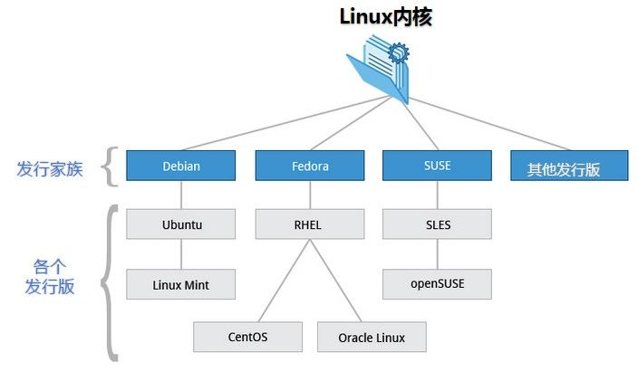
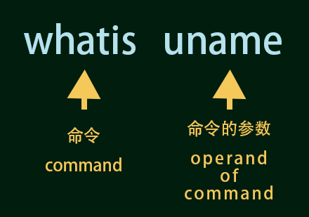

# Oeasy 教 linux

### linux 是什么？

这 **linux** 就是服务器的 **内核 (kernel)**。 咱平常所说的 **linux** 操作系统的全称是 GNU/linux. 单独的 **linux** 一般指的并不是操作系统，而是操作系统的 **[kernel（内核）](https://baike.baidu.com/item/内核)** .linux 内核和 GNU 的组件合在一起，才是操作系统。

这 **linux** 就是服务器的 **内核 (kernel)**。 咱平常所说的 **linux** 操作系统的全称是 GNU/linux. 单独的 **linux** 一般指的并不是操作系统，而是操作系统的 **[kernel（内核）](https://baike.baidu.com/item/内核)** .linux 内核和 GNU 的组件合在一起，才是操作系统。

### 什么是内核 unmae？

#### 如何查找本机的内核

```shell
uname
```

这里需要注意的是：

-   linux 的命令是 **大小写敏感 (case sensitive)** 的，一般命令名都是 **小写**。
-   我们可以看到，内核的版本如 4/18.0-21-generic

查找更多请输入选项 **--help**

```shell
uname --help
```

这里需要注意的是：

-   我们的命令还是小写的 **uname**
-   我们的参数是 --help
-   在 **命令 uname** 和 **参数 --help** 之间有一个英文的 **空格** 隔开

我们可以通过 uname -a 得到全部信息

```shell
uname -a
```

我们可以看到：

-   当前的内核版本是 4.18.0-21-generic
-   cpu 架构指令集是 x86_64
-   当前的发行版是 **ubuntu**

### 什么是发行版 distro

#### 什么是发行版

只靠 linux 内核，我们无法做任何事情，只有内核和各种应用程序在一起，我们才能使用。

发行版 (distro) 的英文原文是 distribution, 是内核和应用程序的集合。一个典型的 Linux 发行版包括：Linux 内核，一些 GNU 程序库和工具，命令行 shell, 也会包含图形界面。

发行版非常多，你可以去 [distrowatch](https://distrowatch.com/) 去看看各种个样的发行版的介绍！

#### 不同种类的发行版

不同的发行版有不同的技能：

-   debian, 适合系统管理和运维
-   ubuntu 安装简单，界面友好，社区活跃。
-   kali 就适合做网络安全方面的操作
-   deepin 国产的深度发行版，界面做的非常好看
-   centos 服务器
-   gentoo 深入底层，透明

#### Linux 发行版三大家族

Linux 发行版虽然很多，但是大体上是三大家族：

-   Debian 家族
-   Rhel 家族
-   Suse 家族



#### Ubuntu 和 Mint

#### Ubuntu

其名称来自非洲 🌍 南部祖鲁语或豪萨语的“ubuntu"一词，意思是“人性”“我的存在是因为大家的存在"，是非洲传统的一种价值观。

发作“oo-boon-too”的音，如果你喜欢添加一些非洲撒哈拉的味道，你可以在第一个"u"，後面带些嗡嗡声：oom-boon-too。😮

Ubuntu 是 Canonical 公司在 debian 稳定版 (stable) 基础上做出的发行版。私营公司做开源软件为什么许的呢？

开源和商业并不是非黑即白的。

#### Canonical 公司的现金主要来源于

-   服务器集群管理工具 Landscape 的服务支持
-   oem 设备的预装系统费用
-   Ubuntu 软件中心的付费位
-   代码托管平台 launchpad.net 服务费用
-   亚马逊云的相关广告
-   Ubuntu 手机预装软件收费
-   [甚至 CD 包内容都可以自己定制](https://sourceforge.net/projects/uck/)

Ubuntu 是非常流行的发行版，整体上来说善于推广，比较讨巧。

#### Mint

Mint 是基于 Ubuntu 的，Ubuntu 是基于 Debian 的，所以 ... Mint 很年轻。

Mint 也是长期霸榜的存在，收入主要靠 t 恤和赞助

#### 如何查看发行版的版本号

```shell
ls /etc/*release
```

-   /etc/\*release 是参数，指的是根（root）下的 etc 文件夹下的所有以 release 结尾的文件


### 我在哪 pwd

`cd=change directory` 意思是改变文件夹。

#### boot 的用法

##### 在计算机系统中

-   boot 是启动
-   bootstrap 是引导程序

##### 启动 boot，是这样的...🤭

1. 关机状态中，内核和整个系统最开始在硬盘里
2. 引导程序通过 cpu 把内核从硬盘的 /boot 目录加载到内存中
3. cpu 开始执行内存中的内核对应的指令
4. 内核完成初始化
5. 内核接管了系统资源（cpu、内存、外设）
6. 操作系统完成启动过程
7. 等待下一步输入的指令

#### 什么是内存

**内存也称主存 Main Momeory**。内存是能够直接被 cpu 操作的存储器。而硬盘光驱是外存，外存中的数据只有先调入内存后才能被中央处理器访问、处理。

#### proc 是什么意思？

proc 指的是 process（进程）， 进程就是被内核从硬盘加载到内存的，正在运行着的程序。

### 灵魂之问 whatis

**用命令去记住命令，用魔法打败魔法** 😎

-   `whatis` 就是我们今天要学的新命令。
-   顾名思义 `whatis` 你是干嘛的？
-   `whatis` 可以告我们某条命令是干什么用的

```shell
whatis uname
```



**这样就可以让 `whatis` 命令告诉我们命令用法。**

-   一般结果是英文的
-   `whatis` 会用最简单的语言形容该命令
-   `whatis` 就像水晶球一样神奇 🥳

### 详查手册 man

查找手册

### 这儿都有啥 ls

```shell
ls -a
```

这下我们看到隐藏文件（以"."开头的）了！

```shell
ls -l
```

通过查询手册我们发现了 `-l` 这个参数，`l` 的意思是 list。这个参数可以以列表方式查询文件

```
ls -l -a
ls -a -l
ls -al
ls -la
```

既能看到隐藏文件，又使用列表方式

**选项-h, 指的是人类可读：**

-   原来的文件大小使用的是字节数量
-   字节数量不利于阅读
-   人们可以使用 k,m,g,t 等存储容量单位来观察了
-   h 的意思是 Human Readable

```shell
ls -h
```

#### 递归查询文件

```shell
ls -R
```

### 那啥在哪 whereis

```shell
whereis ls
```

### 到底哪个 which

查看绝对路径

```shell
which java
```

现在我们有了三个灵魂问题了： ✊

-   whatis 你是谁
-   whereis 你在哪
-   which 到底在哪

#### 灵魂三问

接下来我们来对 `cat` 命令，试试这个灵魂三问：

```shell
whatis cat
whereis cat
which cat
```

### 清屏 chear

### 命令行总结 summary

-   Linux 的历史 ⌨️
-   各种发行版的生生灭灭
-   系统运作的过程 🖥
-   程序运行的过程
-   各种命令 ⌨️
-   命令行技巧 💡

#### 命令 Command🧐

-   uname
-   cd
-   ls
-   cat
-   pwd
-   灵魂三问
    -   whatis
    -   whereis
    -   which
-   man

#### 命令行快捷方式 💡

-   记忆命令
    -   ⬆️ 上一条命令
    -   ⬇️️ 下一条命令
    -   ctrl+r 搜索历史命令
-   快速移动
    -   ⬅️ 向左一格
    -   ➡️️ 向右一格
    -   ctrl⬅️ 向左一个单词
    -   ctrl➡ 向右一个单词
    -   ctrla 直接到头
    -   ctrle 直接到尾
-   快捷键清屏
    -   ctrl+l 清屏
-   快速删除
    -   ctrl+c 忽略当前行
    -   ctrl+u 从光标位置开始，删除左方所有的字符，直到该行开始的位置
    -   ctrl+k 从光标位置开始，删除右方所有的字符，直到该行结束的位置
-   登出系统
    -   ctrl+d 快速退出终端

### 软件包管理 apt

apt 是 advanced package tools 的意思，apt 是 debian 系发行版的软件包管理工具。红帽系的 yum、arch 系的 pacman 也是很好的管理工具。

#### 为什么要用这个工具 🔧

-   不同的 cpu 架构要用不同的二进制文件
-   你可以有两种方法得到某种架构（比如 mips) 的二进制文件
    -   直接下载这个架构的二进制文件
    -   下载这个软件包的源文件，自己编译 ⚙️

**但是这个得到的二进制文件还是有可能不能用，比如：**

软件包之间是有依赖关系的，这个软件包依赖的软件包不存在，甚至被依赖的软件包所依赖的软件包不存在，这就形成了一条链路，我们就需要把这条链路上所有的软件包都下载下来。

**有没有更便捷的方法呢？当然有，我们可以：**

使用 apt 把相关操作封装成接口，我们直接调用 apt 就可以了，所以叫做高级包管理工具，当然你得有地方下载，这就需要镜像站

#### 镜像站（mirrors）

**可以理解为软件包放在网络上。**

我们可以自己访问 [debian 系的镜象列表](https://www.debian.org/mirror/list) 查看，这里面其实对应的就是我们 `/etc/apt/sources.list`。

**镜像站一般也不只提供一个发行版的镜像。**

以 [清华镜像站](https://mirror.tuna.tsinghua.edu.cn/) 为例：

-   有好多发行版
-   点击发行版或软件包后面问号
-   可以获得 `sources.list` 的相关清华源配置代码

### Linuxlogo

下载

```shell
sudo apt install linuxlogo
```

展示

```shell
linuxlogo
```

可以看到发行版的 logo 包括了：

-   内核版本
-   发行版版本
-   编译日期
-   cpu 速度

### 字符画 Figlet

查找

```shell
apt search large character
```

下载

```
sudo apt install figlet
```

使用

```shell
figlet elaine
```


查找所有的模板文字

```shell
sudo find / -name "*.flf"
```

### 风格文字 toilet

查找（搜索）

```shell
apt search toilet
```

展示信息

```shell
apt show toilet
```

下载

```shell
sudo apt install toilet
```

使用

```shell
toilet elaine
```

查找所有的模板文字

```shell
sudo find / -name "*.tlf"
```

### 蒸汽汽车 sl

```shell
sudo apt install sl
sl
sl -l
sl -F
```

`SL` 代表 `Steam Locomotive`，这个命令和 ls 很像，这个命令就是在 ls 打错的情况下提提神：😓

-   `-l` 选项:会出现一个小火车
-   `-F` 选项:会让火车越飞越高，要注意是大写 F
-   `-e` 选项:允许中途被 ctrl+c 打断

### 黑客帝国 cmatrix

下载

```shell
sudo apt install cmatrix
```

-   `-b`: 部分加粗头部变色 bold
-   `-B`: 全部加粗头部变色 Bold
-   `-o`: 老式的 old school
-   `-s`: 屏保模式 Screensaver
-   `-u`: 我们可以设置中间 0-9 的间隔时间 ⏲
    -   0 为无间隔非常快
    -   9 为比较慢
-   `-C`: 后面加上想要的颜色 (Color) 模式
    -   目前支持红绿蓝青品黄黑白

```shell
cmatrix -b
cmatrix -u 9
cmatrix -C blue
```

### 满屏乱码 bb

下载

```shell
sudo apt install bb
```

使用

```shell
bb
```

### 装酷屏幕 hollywood

显示和搜索

```shell
apt show hollywood
apt search hollywood
```

更新源信息及下载 hollywood

```shell
sudo apt update	#更新源信息
apt show hollywood
sudo apt install hollywood
```

使用

```shell
hollywood
```

### aptitude

软件包工具 apt

软件包哦不断能下载，也能升级，还能删除

专门管理软件包的 aptitude

### 牛说 cowsay

下载

```shell
sudo apt install cowsay
```

使用

```shell
cowsay johan
```

-   `-b` 极简主义 Borg Mode
-   `-d` 死亡状态 dead
-   `-g` 贪婪金钱 greedy
-   `-p` 偏执狂 paranoia
-   `-s` 石化 stone
-   `-w` 紧张睁大眼 wired
-   `-t` 闭眼的
-   `-e` 设置眼睛 eye 字符 后面眼睛字符

```shell
cowsay -p johan
cowsay -s johan
cowsay -e *- johan
```

除了 cowsay 之外，cowthink 也可以使用

```shell
cowthink -p joahan
```

### 管道 pipe

pipe 原理

-   中间的那条竖线 | （在键盘回车上面）, 就是 pipe
-   pipe, 意思是管道
-   原来 figlet "oeasy"命令执行之后进行输出
-   输出流，直接流到屏幕 (stdout) 上
-   现在给他加了一个管道|
-   figlet 不直接输出到屏幕了
-   figlet 把输出结果流到了 cowsay 指令中
-   cowsay 接收到了流过来的 figlet 的结果做为参数
-   cowsay 的输出结果最终流到了屏幕 (stdout) 上

```shell
toilet  --gay oeasy | cowthink -n
```

**我对管道的理解：就是下一步**

后续就不用学了
