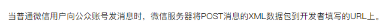

# 微信服务端开发

> 这里的笔记比较杂

起服务，例如用 Koa 起个服务，后端请求微信提供的方法...

## 什么是 access_token

> access_token 是公众号的全局唯一票据，公众号调用各接口时都需使用access_token。有效期为2小时，且一天最多只能调用2000次

这样的话，access_token 必须缓存起来（不然它只有2000次调用）

我们定时每1个小时刷新一次，一天也就调用24次，搓搓有余了

思路是这样，调用XX方法，如果有缓存，用缓存的；如果没有，去调用接口

做法：每一个小时去调用一次接口

## 什么是 jsapi_ticket

jsapi_ticket 是公众号用于调用微信JS接口的临时票据。一般为2小时，通过access_token获取。

无论是 access_token 还是 jsapi_ticket ，都需要进行缓存

## 如何监听消息管理？

如何监听自定义菜单的点击事件？

需要配置“接口配置信息”，这个配通了，就是说，微信会发消息给你

但是因为翻墙的原因，本机的ip获取不到，只能通过内网穿透来实现，找了natappfree来实现

使用 `koa-xml-body` 来解析 xml 格式文件

但是需要注意的是，`app.use(xmlParser());`  要放在 `app.use(bodyParser());` 前面

## 内网穿透

为了在本机调试，需要内网穿透，本来用 natapp，但是偶尔会连接不上，又查了查，找到最好的内网穿透的工具：**ngrok**

## 关于media_id

想在公众号里回复图片，视频或者图文，就要有media_id。找了半圈，新增临时素材能获取media_id。有效期是3天

### 坑点：axios请求怎么样也上传不了照片

这里的常见错误：[公众号开发 调用【上传图文消息内的图片获取URL】接口时，返回 412 错误？](https://developers.weixin.qq.com/community/develop/doc/00000ef32dc64883d9d93f31f56800)

### 坑点2：微信测试号不能上传 永久media_id，但是文档没写

永久素材可以一般要在有素材内容的公众号里直接拿过来

[微信公众号上传的永久素材得到的media_id无效](https://segmentfault.com/q/1010000012972666)

## 如何让在koa中使用redis ，让redis 同步

加入一个库 async-redis

让它支持异步

## 定时功能

定时 node-schedule 接入，每一小时定时获取 access_token
